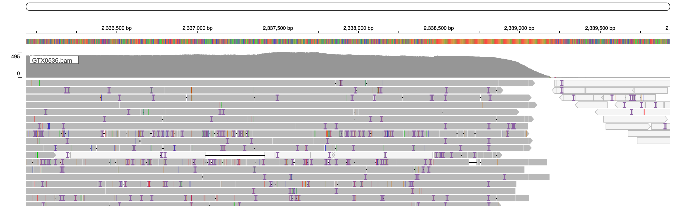

```{r setup, include=FALSE}
knitr::opts_chunk$set(echo = TRUE)
library(tidyverse)
library(kableExtra)
```

## 1. Purify the genome
#### Exploring coverage and GC% 
* From the sequencing company, got the assembly consisting of 174 contigs with 76,648,537bp and 93.9% compeleteness (BUSCO on chlorophyta_odb10). However, the company also reported assemblies made with less data and of only slightly lower quality on 26 contigs. Could it be that the bigger assembly contains contaminants?
* Will do binning to identify contigs that might be external
* First, use minimap to align the reads onto the assembly
```{r,eval=F}
mkdir analysis_and_temp_files/02_genome_annotation

source package c92263ec-95e5-43eb-a527-8f1496d56f1a 
source package 222eac79-310f-4d4b-8e1c-0cece4150333

minimap2 -t 20 -a data/your-data_fg25005_2025-03-20_1225/FG25005_01_GTX0536.fasta data/your-data_fg25005_2025-03-20_1225/FG25005_05_PAO94355_20250305_dorado_7.4.13_sup_pass.fastq.gz | samtools sort -@8 -o analysis_and_temp_files/04_genome_annotation/GTX0536.bam

samtools index analysis_and_temp_files/04_genome_annotation/GTX0536.bam
samtools faidx analysis_and_temp_files/02_genome_annotation/GTX0536.fasta
```
* Use metaBAT, which produced 23 bins
```{r,eval=F}
source package 0a2dffce-c151-4379-abe9-866414c91cd7
cp data/your-data_fg25005_2025-03-20_1225/FG25005_01_GTX0536.fasta analysis_and_temp_files/04_genome_annotation/GTX0536.fasta

runMetaBat.sh -t 20 analysis_and_temp_files/04_genome_annotation/GTX0536.fasta analysis_and_temp_files/04_genome_annotation/GTX0536.bam

mv  GTX0536.fasta.* analysis_and_temp_files/04_genome_annotation
```
* Identify prokaryotic MAGs with CheckM (plus calculate coverage depth for each contig and gc%). No plausible bacterial genomes here
```{r,eval=F}
source package  5a1c6a9a-f666-4eaa-9409-3e7435d86406
checkm coverage analysis_and_temp_files/04_genome_annotation/GTX0536.fasta.metabat* analysis_and_temp_files/04_genome_annotation/GTX0536.cov analysis_and_temp_files/04_genome_annotation/GTX0536.bam -x fa

sbatch --mem=100G -c 20 --wrap="source package  5a1c6a9a-f666-4eaa-9409-3e7435d86406; checkm  lineage_wf analysis_and_temp_files/04_genome_annotation/GTX0536.fasta.metabat* analysis_and_temp_files/04_genome_annotation/GTX0536_checkm -x fa --tab_table > analysis_and_temp_files/04_genome_annotation/GTX0536.checkm"

source package /tsl/software/testing/bin/bbmap-37.90 
stats.sh in=analysis_and_temp_files/04_genome_annotation/GTX0536.fasta gc=analysis_and_temp_files/04_genome_annotation/GTX0536.gc gcformat=4
```
* Visualize binning result. One contig (ptg000005c) had a super high coverage at 2246x, which is probably an organelle genome. The rest are split into two groups at ~36% GC and 50%
```{r}
gc<-read.delim2("../analysis_and_temp_files/02_genome_annotation/GTX0536.gc",header=T)
colnames(gc)[1]<-"contig"
gc$GC<-as.numeric(gc$GC)
cov<-read.delim2("../analysis_and_temp_files/02_genome_annotation/GTX0536.fasta.depth.txt")
colnames(cov)[1]<-"contig"
bins<-read.delim2("../analysis_and_temp_files/02_genome_annotation/GTX0536.cov")
colnames(bins)[1]<-"contig"

df<-left_join(gc,cov) %>% left_join(bins)
df$totalAvgDepth <- as.numeric(df$totalAvgDepth )

ggplot(df)+geom_point(aes(x=GC,y=totalAvgDepth,color=Bin.Id))
```

* Let's remove ptg000005c:
  * This highlighted another contig ptg000019l at 390x: could be another organelle genome, but is >2Mbp. Maybe a part of the nuclear genome? 
  * The group at 50% GC and 200x has longest contigs. Most likely, these correspond to the nuclear genome
```{r}
library(patchwork)
g1<-ggplot(df %>% filter(contig!="ptg000005c"))+geom_point(aes(x=GC,y=totalAvgDepth,color=Bin.Id))
g2 <- ggplot(df %>% filter(contig!="ptg000005c"))+geom_point(aes(x=GC,y=totalAvgDepth,color=Length))
g1/g2
```

* Lets look closer at this region. It contained 22 contigs, most from bins 9 and 7. bins 2, 14, and 22 (just one contig each) are also very clearly in the same cloud. bins 13 and 18 (again just one contig each; coverage in the range 190-200) are probably also the part of the genome with the length of >2Mbp. Bin 18 (coverage 181x) is slightly below 1Mbp. The lowest three contigs in coverage are also the shortest (58 kbp to 190 kbp)
```{r}
g1<-ggplot(df %>% filter(GC >0.45,totalAvgDepth > 150, totalAvgDepth <300))+ geom_point(aes(x=GC,y=totalAvgDepth,color=Bin.Id))
g2 <- ggplot(df %>% filter(GC >0.45,totalAvgDepth > 150, totalAvgDepth <300))+ geom_point(aes(x=GC,y=totalAvgDepth,color=Length))
g1+g2
```


#### Blasting against NCBI
* Look at ten matches per contig
```{r,eval=F}
source package /tsl/software/testing/bin/blast+-2.9.0  
blastn \
 -query analysis_and_temp_files/04_genome_annotation/GTX0536.fasta \
 -db /tsl/data/ncbi_database/blast/nt_20220819/nt \
 -outfmt '6 qseqid staxids bitscore std' \
 -max_target_seqs 10 \
 -max_hsps 1 \
 -evalue 1e-25 \
 -out analysis_and_temp_files/04_genome_annotation/GTX0536.blast.out -num_threads 20
```
* Go taxonomy for each hit, and identified the hits that are labelled as mitochondrial
```{r,eval=F}
library(taxize)

#get taxid for each hit based on its accession ID
blast_results<-read.delim2("../analysis_and_temp_files/02_genome_annotation/GTX0536.blast.out",header=F)

get_taxid <- function(x){
  list <- genbank2uid(id = x, key="86df5e42e9751ae03c5e114326c1740ef008")
  list2 <- lapply(list,attributes)
df <- data.frame("accession"=x,
                 "taxid"=list[[1]][1],
      "description"=list2[[1]]$name)
return(df)}

l<-lapply(blast_results$V5,get_taxid)
acc_taxid <- do.call(rbind,l)
acc_taxid <- acc_taxid %>% filter(!is.na(taxid),taxid!="") %>% distinct()

#get taxonomy for each taxid
get_taxonomy<- function(x){
  df <- classification(x,db="ncbi",key="86df5e42e9751ae03c5e114326c1740ef008")[[1]]
  df <- df %>% filter(rank %in% c("domain","kingdom","phylum","class")) %>% select(-id) %>% mutate(taxid=x)
  return(df)}

l2<-lapply(unique(acc_taxid$taxid) ,get_taxonomy)
taxonomy <- do.call(rbind,l2) %>% pivot_wider(names_from = rank,values_from=name)

#combine all data together
blast <- blast_results %>% select(V1,V5)
colnames(blast) <- c("contig","accession")
blast2 <- acc_taxid %>% left_join(taxonomy) %>% left_join(blast)  %>% distinct()

#save the table so that I don't need to re-run the ncbi step
write.table(blast2, "../analysis_and_temp_files/02_genome_annotation/GTX0536.blast.taxonomy.txt",col.names = T, row.names = F, quote = F,sep="\t")
```
* This confirms that the sequences in the cluster with bin 7 and bin 9 are the nuclear genome
  * Plastid genome is ptg000005c
  * ptg000019l also has plastid hits, which is weird given that it's linear and >2Mbp, will keep an eye on that
  * Mitochondrial genome is the cluster at 35 GC%, and it clearly failed to assemble, which is common. Will re-assemble it later on with a specialized software
```{r,fig.width=8,fig.height=4}
library(gridExtra)
library(ggforce)

blast<-read.delim2("../analysis_and_temp_files/02_genome_annotation/GTX0536.blast.taxonomy.txt",header=T)

blast<- blast %>% mutate(label=case_when(
  is.na(domain) ~ "Virus",
  phylum=="Chlorophyta" & grepl("mitochon",description,) ~ "Chlorophyta mitochondrial",
  phylum=="Chlorophyta" & grepl("chloroplast",description) ~ "Chlorophyta plastid",
  phylum=="Chlorophyta" & ! grepl("chloroplast",description) & !grepl("mitochon",description) ~ "Chlorophyta nuclear",
  phylum %in% c("Streptophyta","Rhodophyta") ~ "other Archaeplastida",
  phylum %in% c("Annelida" ,"Arthropoda","Chordata","Nematoda","Bryozoa")~ "Animals"
))

blast_summary<-blast %>% filter(!is.na(label)) %>%
  group_by(label,contig) %>% summarize(n=n()) %>%
  ungroup() %>% group_by(contig) %>% top_n(n=1)
   

df<- blast_summary %>% left_join(df)

ggplot(df)+geom_point(aes(x=GC,y=totalAvgDepth,color=label))+
  facet_zoom(ylim = c(0, 400))
ggsave("../results/gc_cov.pdf",width=9,height=4)
```


#### Align to the genome from ASG
```{r,eval=F}
source package 222eac79-310f-4d4b-8e1c-0cece4150333
minimap2 -x asm20 -t 10 --secondary=no data/SL0000003.fasta analysis_and_temp_files/04_genome_annotation/GTX0536.fasta > analysis_and_temp_files/04_genome_annotation/GTX0536_SL0000003.paf
```
* Alignment overall looks reasonable (here showing only stretches >20kbp with quality >40)
```{r,fig.width=8,fig.height=8}
library(pafr)
paf<-read_paf("../analysis_and_temp_files/02_genome_annotation/GTX0536_SL0000003.paf")
paf_filtered <-subset(paf, alen > 20000 & mapq > 40)
paf_filtered <-paf_filtered  %>% distinct()
align<-paf_filtered %>% group_by(qname,tname) %>% summarize(total_alen = sum(alen)) %>% 
  pivot_wider(names_from = tname,values_from = total_alen,values_fill=0)

dotplot(paf_filtered,order_by="qstart",label_seqs=F,dashes=F) + theme_bw()

```

* Checking which contigs mapped to which in the two assembly, see clear 'partner' in almost all cases.
  * Exception 1: ptg000002l has about the same total length of matches with OZ234913.1 and OZ234917.1
  * Exception 2: ptg000023l and ptg000065l are partnerless
```{r,fig.width=8,fig.height=15}
align<-paf_filtered %>% group_by(qname,tname) %>% summarize(total_alen = sum(alen)) %>% 
  pivot_wider(names_from = tname,values_from = total_alen,values_fill=0)
align %>% kable(format = "html", col.names = colnames(align)) %>%
  kable_styling() %>%
  kableExtra::scroll_box(width = "100%", height = "400px")
```
* Let's picture syntheny for all partners
```{r,fig.width=8,fig.height=25}
ptg000001l<-plot_synteny(paf_filtered, q_chrom="ptg000001l", t_chrom="OZ234914.1", centre=F)
ptg000002l<-plot_synteny(paf_filtered, q_chrom="ptg000002l", t_chrom="OZ234913.1", centre=F)
ptg000002l_2<-plot_synteny(paf_filtered, q_chrom="ptg000002l", t_chrom="OZ234917.1", centre=F)
ptg000003l<-plot_synteny(paf_filtered, q_chrom="ptg000003l", t_chrom="OZ234912.1", centre=F)
ptg000004l<-plot_synteny(paf_filtered, q_chrom="ptg000004l", t_chrom="OZ234919.1", centre=F)
ptg000006l<-plot_synteny(paf_filtered, q_chrom="ptg000006l", t_chrom="OZ234921.1", centre=F)
ptg000007l<-plot_synteny(paf_filtered, q_chrom="ptg000007l", t_chrom="OZ234924.1", centre=F)
ptg000008l<-plot_synteny(paf_filtered, q_chrom="ptg000008l", t_chrom="OZ234920.1", centre=F)
ptg000009l<-plot_synteny(paf_filtered, q_chrom="ptg000009l", t_chrom="OZ234909.1", centre=F)
ptg000010l<-plot_synteny(paf_filtered, q_chrom="ptg000010l", t_chrom="OZ234908.1", centre=F)
ptg000011l<-plot_synteny(paf_filtered, q_chrom="ptg000011l", t_chrom="OZ234925.1", centre=F)
ptg000012l<-plot_synteny(paf_filtered, q_chrom="ptg000012l", t_chrom="OZ234906.1", centre=F)
ptg000013l<-plot_synteny(paf_filtered, q_chrom="ptg000013l", t_chrom="OZ234915.1", centre=F)
ptg000014l<-plot_synteny(paf_filtered, q_chrom="ptg000014l", t_chrom="OZ234916.1", centre=F)
ptg000015l<-plot_synteny(paf_filtered, q_chrom="ptg000015l", t_chrom="OZ234910.1", centre=F)
ptg000016l<-plot_synteny(paf_filtered, q_chrom="ptg000016l", t_chrom="OZ234907.1", centre=F)
ptg000017l<-plot_synteny(paf_filtered, q_chrom="ptg000017l", t_chrom="OZ234911.1", centre=F)
ptg000018l<-plot_synteny(paf_filtered, q_chrom="ptg000018l", t_chrom="OZ234918.1", centre=F)
ptg000019l<-plot_synteny(paf_filtered, q_chrom="ptg000019l", t_chrom="OZ234923.1", centre=F)
ptg000020l<-plot_synteny(paf_filtered, q_chrom="ptg000020l", t_chrom="OZ234922.1", centre=F)
ptg000001l/(ptg000002l+ptg000002l_2)/ptg000003l/ptg000004l/ptg000006l/ptg000007l/ptg000008l/ptg000009l/ptg000010l/ptg000011l/ptg000012l/ptg000013l/ptg000014l/ptg000015l/ptg000016l/ptg000017l/ptg000018l/ptg000019l/ptg000020l
```

* The remaining two pairings do not seem legit
```{r,fig.width=8,fig.height=3}
ptg0000023l<-plot_synteny(paf_filtered, q_chrom="ptg000023l", t_chrom="OZ234912.1", centre=TRUE)
ptg0000065l<-plot_synteny(paf, q_chrom="ptg000065l", t_chrom="OZ234921.1", centre=TRUE)
ptg0000023l/ptg0000065l
```

* Will nonetheless include contig 23 
* Saved the 20 contigs as `analysis_and_temp_files/02_genome_annotation/GTX0536_nuclear.fasta`
```{r,eval=F}
write.table(align$qname[1:19], "../analysis_and_temp_files/02_genome_annotation/GTX0536_nuclear.txt",col.names = F, row.names = F, quote = F,sep="\t")
source package 1041444f-cd25-4107-a5c7-5e86cb1728fe
seqkit grep -i -f analysis_and_temp_files/02_genome_annotation/GTX0536_nuclear.txt analysis_and_temp_files/02_genome_annotation/GTX0536.fasta  > analysis_and_temp_files/02_genome_annotation/GTX0536_nuclear.fasta 
```


#### Spotted a problem while visualizing GC% and telomeres
* Used [script from Markus Hiltunen](https://github.com/markhilt/genome_analysis_tools/blob/master/find_telomeres.py)
* As a query used “CCCTAAA”, which is a telomeric repeat conserved between green algae and land plants (see Fulnekova et al. 2012)
  * 12 contigs have telomeres on both ends
  * 5 have on one end
  * 2 had none
```{r,eval=F}
python code/detect_telomers.py analysis_and_temp_files/02_genome_annotation/GTX0536_nuclear.fasta -m "CCCTAAA" > analysis_and_temp_files/02_genome_annotation/GTX0536_telomere_detection.txt
```

* Used SEQtk and got GC% for non-overlapping windows of 1000 bp
```{r,eval=F}
source package 46a62eca-4f8f-45aa-8cc2-d4efc99dd9c6
seqkit sliding  analysis_and_temp_files/02_genome_annotation/GTX0536_nuclear.fasta -s 1000 -W 1000  | seqkit fx2tab -n -g > analysis_and_temp_files/02_genome_annotation/GTX0536_nuclear.fasta_GC_sliding.txt
```
* Everything looks fine, except for the low GC% portion of ptg000019l. That's the same part of the contig that had hits to plastid genomes, and the same that wasn't aligned to a contig in the ASG genome. Could this be an misassembly?
```{r}
library(stringr)
library(viridis)
gc<-read.delim2("../analysis_and_temp_files/02_genome_annotation/GTX0536_nuclear.fasta_GC_sliding.txt",header=F)[,c(1,2)]
colnames(gc)<-c("window","gc_content")
##get contig name and start of the window
gc$contig<-sub("_sliding.*", "", gc$window)  
gc$window<-sub(".*:", "", gc$window)
gc$window_start<-sub("-.*", "", gc$window) %>% as.numeric()
gc$gc_content<-gc$gc_content %>% as.numeric()

##add data for telomere annotation
tel<-read.delim2("../analysis_and_temp_files/02_genome_annotation/GTX0536_telomere_detection.txt",header=F)[,c(1,2)]
colnames(tel)<-c("contig","position")
tel_start_contig_list<-tel[tel$position=="forward",1] #list all contigs that have telomer at the contig start (corresponds to 'forward')
tel_end_contig_list<-tel[tel$position=="reverse",1] #list all contigs that have telomer at the contig start (corresponds to 'forward')

## get 
tel_start<-gc %>% select(contig,window_start) %>% mutate(telomere="absent") %>% group_by(contig) %>% arrange(window_start) %>% filter(row_number()<25 & contig %in% tel_start_contig_list) %>% mutate(telomere="present") %>% ungroup()

tel_end<-gc %>% select(contig,window_start) %>% mutate(telomere="absent") %>% group_by(contig) %>% arrange(window_start) %>% 
  slice(tail(row_number(), 25)) %>% filter(contig %in% tel_end_contig_list) %>% mutate(telomere="present") %>% ungroup()

gc<-gc %>% left_join(rbind(tel_start,tel_end))
gc$telomere[is.na(gc$telomere)]<-"absent"

##visualize
ggplot(gc)+
  geom_tile(aes(y=fct_reorder(contig,window_start),x=window_start,color=gc_content))+
  geom_tile(aes(y=fct_reorder(contig,window_start),x=window_start,alpha=telomere),fill="red")+
  xlab("")+ylab("")+
   scale_alpha_discrete(range=c(0,1))+
  scale_color_viridis(begin = 1,end = 0)+
   scale_x_continuous(breaks = c(0,1000000,2000000,3000000,4000000),
                     labels = c("0","1 Mbp","2 Mbp","3 Mbp","4 Mbp"))+
  theme_minimal()
```

#### Examine read alignment to detected and fix misassemblies
* Looked at the bam file around the ptg000019l:2410001-2420000 window, where the shift from ~50% GC to ~35% happens
  * Found a clean break at 2,410,725 bp. Clearly, the end portion of the contig comes from the cloroplast, which also explains why the average coverage of this contig was higher than the rest of the nuclear genome. Will remove the chloroplast mathcing portion
```{r, out.width = '80%'}

```

* We can exclude that the same problem happened to other contigs, since they have very similar coverage to each other (192-210x), none had hits to chloroplast ,and none had more than one hit to mitochondrion
* While we are at it, let's look at ptg000002l:2972181-3246738, which is the border of the parts of the contig aligned to OZ234917.1 and OZ234913.1. Could this also be a misassembly?
* To simplify searching, let's calculate the depth in non-overlapping 1000bp windows for a larger region 2,750,000-3,500,000
```{r,eval=F}
for i in {2750..3500}; do s=$(($i*1000)); e=$(($i*1000+1000)); samtools coverage -r ptg000002l:$s-$e analysis_and_temp_files/02_genome_annotation/GTX0536.bam; done > analysis_and_temp_files/02_genome_annotation/ptg000002l.cov
grep "ptg000002l" analysis_and_temp_files/02_genome_annotation/ptg000002l.cov > analysis_and_temp_files/02_genome_annotation/ptg000002l.filtered.cov
```
* Coverage is uneven here, but there are no clear changes in GC%. The window with the lowest coverage still shows to ha
```{r}
depth<-read.delim2("../analysis_and_temp_files/02_genome_annotation/ptg000002l.filtered.cov",header=F)[,c(2,7)]
colnames(depth)<-c("window","depth")
depth$depth <- as.numeric(depth$depth)
gc$window<-as.numeric(gc$window_start-1)

x<-gc %>% filter(contig=="ptg000002l",window>=2750000,window<=3500000) %>% left_join(depth) %>%
  select(window,gc_content,depth) %>% 
  pivot_longer(-window,names_to = "statistic",values_to = "n") %>%
  filter(!is.na(n))
ggplot(x,aes(x=window,y=n))+ geom_col()+
  facet_wrap(~statistic,scales = "free_y",ncol=1)
```

* Looked in IGV at the portion with the most drastic coverage jump (417x in the window 3,024,000 to 100x in 3,025,000), but it still has reasonable coverage and no obvious breaks, as well as the flanking regions
```{r, out.width = '80%'}

```

* Can we find telomeres in this region?
  * Nope! got a few hits, but those are not clustered and are likely by chance
```{r,eval=F}
samtools faidx analysis_and_temp_files/02_genome_annotation/GTX0536_nuclear.fasta ptg000002l:2750000-3500000 > analysis_and_temp_files/02_genome_annotation/ptg000002l_suspect.fa

grep "CCCTAAACCCTAAA" -n analysis_and_temp_files/02_genome_annotation/ptg000002l_suspect.fa
grep "GGGTTTAGGGTTT" -n analysis_and_temp_files/02_genome_annotation/ptg000002l_suspect.fa
```
* Can we find telomeric repeats in the middle of other contigs? Searched the entire assembly
```{r,eval=F}
seqkit locate -i -p "CCCTAAACCCTAAACCCTAAACCCTAAACCCTAAA" analysis_and_temp_files/02_genome_annotation/GTX0536_nuclear.fasta >  analysis_and_temp_files/02_genome_annotation/GTX0536_telomeric_repeats_across.txt
```
* Got one short match in the middle of ptg000002l
  * Back-to-back reverse and forward repeats in the middle of ptg000003l
  * one area in ptg000004l, ptg000008l, and ptg000009l; all reverse
  * Several areas, both forward and reverse in ptg000019l
```{r}
library(ivs)

repeats<-read.delim2("../analysis_and_temp_files/02_genome_annotation/GTX0536_telomeric_repeats_across.txt",header=T)
colnames(repeats)[1]<-"contig"
repeats<- repeats %>% left_join(df %>% select(contig,Length))

#remove hits that are closer than 1,500 bp tp a contig end
repeats2 <- repeats %>% mutate(Length_2000 = Length-2000) %>%
  filter((strand=="+" & start>2000) | (strand=="-" & end<Length_2000))

repeats3 <- repeats2 %>%
  group_by(contig,strand) %>%
  mutate(group = iv_identify_group(iv(start, end))) %>%
  group_by(group, .add = TRUE) %>%
  summarise(start = min(iv_start(group)),
             end = max(iv_end(group))) %>%
  select(contig,strand,start,end)
repeats3%>% kable(format = "html", col.names = colnames(repeats3)) %>%
  kable_styling() %>%
  kableExtra::scroll_box(width = "100%", height = "300px")
```

* Identified several irregularity, where at the end of a contig there is a break. To remedy this, will remove the 'tails'. From ptg000003l remove bases after 3706235 
```{r, out.width = '80%'}

```

* From ptg000004l remove bases after 3027428
```{r, out.width = '80%'}

```

* All other matches to telomeric repeats were not associated with assembly breaks  `analysis_and_temp_files/02_genome_annotation/checking_for_misassemblies/`
* To be safe, examined other end of contigs that lack telomeres to exclude similar problems. Found that beginning of contig 8 suffers from the same problem. Will remove first 1035 bp
```{r, out.width = '80%'}

```

* Will remove bases past 4,931,045 from ptg000016l
```{r, out.width = '80%'}

```

* Will remove bases past 2,339,172 ptg000020l and before 1071
```{r, out.width = '80%'}


```

#### Scafolding of the 'tail' of ptg000003l? Didn't work 
* Unlike other 'tails' which short, the tail of ptg000003l is (3706236 to 3719598) is 13362 bp, and it also seem to contain a forward telomeric repeat. Could it be a fragment of a different contig? 
  * Looking at the existing paf file, this region only got hit to middle of two different contigs, each <1500bp
```{r}
subset(paf, qname=="ptg000003l" & qend>3706236 & mapq > 40) %>%
  select(qname,qstart,qend,tname,tstart,tend) %>% distinct()
```
* Aligning just the tail against the SL0000003 genome, didn't get any hits with better quality
* Aligning it against the GTX0536 assembly from which the tail is removed, it maps back on to the same contig but in reverse strand
```{r,eval=F}
samtools faidx analysis_and_temp_files/02_genome_annotation/GTX0536.fasta ptg000003l:3706236-3719598 > analysis_and_temp_files/02_genome_annotation/ptg000003l_tail.fa 
blastn -query analysis_and_temp_files/02_genome_annotation/ptg000003l_tail.fa  -subject data/SL0000003.fasta -outfmt 6

minimap2 -x asm20 -t 10 --secondary=no data/SL0000003.fasta analysis_and_temp_files/02_genome_annotation/ptg000003l_tail.fa > analysis_and_temp_files/02_genome_annotation/ptg000003l_tail_SL0000003.paf

ptg000003l:3706236-3719598      13363   4020    5359    -       OZ234919.1      2842224 730997  732352  615     1378    60      tp:A:P  cm:i:69 s1:i:597      s2:i:280        dv:f:0.0078     rl:i:414
ptg000003l:3706236-3719598      13363   1660    2765    -       OZ234917.1      2908467 564827  565829  283     1127    60      tp:A:P  cm:i:18 s1:i:252      s2:i:0  dv:f:0.0081     rl:i:414
ptg000003l:3706236-3719598      13363   3349    3833    -       OZ234916.1      3059195 732081  732606  106     525     17      tp:A:P  cm:i:8  s1:i:98       s2:i:85 dv:f:0.0166     rl:i:414
ptg000003l:3706236-3719598      13363   672     1119    +       OZ234913.1      3320455 426382  426832  57      453     0       tp:A:P  cm:i:3  s1:i:54       s2:i:46 dv:f:0.0503     rl:i:414
ptg000003l:3706236-3719598      13363   570     858     +       OZ234922.1      2422596 249762  250050  46      288     5       tp:A:P  cm:i:3  s1:i:46       s2:i:0  dv:f:0.0562     rl:i:414


minimap2 -x asm20 -t 10 analysis_and_temp_files/02_genome_annotation/GTX0536_nuclear_final.fasta analysis_and_temp_files/02_genome_annotation/ptg000003l_tail.fa

ptg000003l:3706236-3719598      13363   233     13353   -       ptg000003l:1-3706235    3706235 3692266 3705653 7673    13430   60      tp:A:P  cm:i:1169     s1:i:7578       s2:i:290        dv:f:0.0002     rl:i:945
```

#### Finalized the genome
* Made a new fasta file where portion of contigs outlined above are truncated
```{r,eval=F}
seqkit grep -i -f analysis_and_temp_files/02_genome_annotation/GTX0536_nuclear_final.txt analysis_and_temp_files/02_genome_annotation/GTX0536.fasta  > analysis_and_temp_files/02_genome_annotation/GTX0536_nuclear_final.fasta 

samtools faidx analysis_and_temp_files/02_genome_annotation/GTX0536.fasta ptg000019l:1-2410725 >> analysis_and_temp_files/02_genome_annotation/GTX0536_nuclear_final.fasta 

samtools faidx analysis_and_temp_files/02_genome_annotation/GTX0536.fasta ptg000003l:1-3706235 >> analysis_and_temp_files/02_genome_annotation/GTX0536_nuclear_final.fasta 

samtools faidx analysis_and_temp_files/02_genome_annotation/GTX0536.fasta ptg000004l:1-3027428 >> analysis_and_temp_files/02_genome_annotation/GTX0536_nuclear_final.fasta 

samtools faidx analysis_and_temp_files/02_genome_annotation/GTX0536.fasta ptg000008l:1035-2212220 >> analysis_and_temp_files/02_genome_annotation/GTX0536_nuclear_final.fasta 

samtools faidx analysis_and_temp_files/02_genome_annotation/GTX0536.fasta ptg000016l:1-4931045 >> analysis_and_temp_files/02_genome_annotation/GTX0536_nuclear_final.fasta 

samtools faidx analysis_and_temp_files/02_genome_annotation/GTX0536.fasta ptg000020l:1071-2339172 >> analysis_and_temp_files/02_genome_annotation/GTX0536_nuclear_final.fasta 

```

* At a later stage, added another contig (ptg000023l), after it became clear that it contained GEX1 gene that wasn't found elsewhere in the genome, but was present in all other Trebouxia genomes (minus SL0003 genome)
```{r,eval=F}
cp analysis_and_temp_files/02_genome_annotation/GTX0536_nuclear_final.fasta analysis_and_temp_files/02_genome_annotation/GTX0536_nuclear_final2.fasta 

source package aeee87c4-1923-4732-aca2-f2aff23580cc
samtools faidx analysis_and_temp_files/02_genome_annotation/GTX0536.fasta ptg000023l >> analysis_and_temp_files/02_genome_annotation/GTX0536_nuclear_final2.fasta 

```
* Cleaned and sorted the assembly using funannotate
```{r,eval=F}
singularity run ../singularity/funannotate.sif funannotate sort -i analysis_and_temp_files/02_genome_annotation/GTX0536_nuclear_final2.fasta -o analysis_and_temp_files/02_genome_annotation/GTX0536_nuclear_final_sort2.fasta -b GTX0536
```

#### Check completeness scores
* BUSCO score: C:96.5%[S:95.9%,D:0.6%],F:0.7%,M:2.8%,n:1519  
(BUSCO v4.0.6, chlorophyta_odb10)
```{r,eval=F}
mkdir analysis_and_temp_files/02_genome_annotation/GTX0536_busco2
source package ca890cd7-f81d-4c22-9f4a-5b40ab671c79
source package 85f2de80-4bd0-48dc-9303-bba1a19206e4
export AUGUSTUS_CONFIG_PATH=../02_long_read_assemblies/analysis_and_temp_files/02_binning/tmp_augustus/config
busco -i analysis_and_temp_files/02_genome_annotation/GTX0536_nuclear_final2.fasta -o GTX0536 --out_path analysis_and_temp_files/02_genome_annotation/GTX0536_busco2  -m  genome -l /tsl/data/busco_lineages/chlorophyta_odb10 --offline -f -c 20
```

* For comparison, analyzed the ASG genome, and got slightly worse results
  * C:92.3%[S:91.6%,D:0.7%],F:0.5%,M:7.2%,n:1519 
```{r,eval=F}
busco -i data/SL0000003.fasta -o SL0000003 --out_path analysis_and_temp_files/02_genome_annotation/SL0000003_busco  -m  genome -l /tsl/data/busco_lineages/chlorophyta_odb10 --offline -f -c 20
```

* Visualize completeness scores
```{r}
library(geomtextpath)

busco1<-read.delim("../analysis_and_temp_files/02_genome_annotation/GTX0536_busco/GTX0536/short_summary.specific.chlorophyta_odb10.GTX0536.txt",header=F,skip = 9)
busco1$type<-c("Complete (95.9%)","Duplicated (0.6%)","Fragmented (0.7%)","Missing (2.8%)","Total")
busco1<-busco1[1:4,]
hsize <- 1.5
busco1$x<-hsize

b1<-ggplot(busco1,aes(y=V2,fill=type,x=hsize))+geom_col()+
  coord_curvedpolar(theta = "y")+  xlim(c(0.2, hsize + 0.5))+
  scale_fill_manual(values=c("Complete (95.9%)"="#60ba30","Duplicated (0.6%)"="#1f5900","Fragmented (0.7%)"="#ccf2b8","Missing (2.8%)"="white"))+
  theme_void()+theme(legend.title = element_blank(),legend.text = element_text(size=9),
                     legend.key=element_rect(colour="#969696"))+
  ggtitle("GTX0536")

busco2<-read.delim("../analysis_and_temp_files/02_genome_annotation/SL0000003_busco/SL0000003/short_summary.specific.chlorophyta_odb10.SL0000003.txt",header=F,skip = 9)
busco2$type<-c("Complete (91.6%)","Duplicated (0.7%)","Fragmented (0.5%)","Missing (7.2%)","Total")
busco2<-busco2[1:4,]
hsize <- 1.5
busco2$x<-hsize

b2<-ggplot(busco2,aes(y=V2,fill=type,x=hsize))+geom_col()+
  coord_curvedpolar(theta = "y")+  xlim(c(0.2, hsize + 0.5))+
  scale_fill_manual(values=c("Complete (91.6%)"="#60ba30","Duplicated (0.7%)"="#1f5900","Fragmented (0.5%)"="#ccf2b8","Missing (7.2%)"="white"))+
  theme_void()+theme(legend.title = element_blank(),legend.text = element_text(size=9),
                     legend.key=element_rect(colour="#969696"))+
  ggtitle("SL0000003")
b1+b2
ggsave("../results/busco.pdf",plot=b1,width=3,height=3)
```


#### Visualizing GC% and telomeres again
```{r,eval=F}
python code/detect_telomers.py analysis_and_temp_files/02_genome_annotation/GTX0536_nuclear_final_sort2.fasta -m "CCCTAAA" > analysis_and_temp_files/02_genome_annotation/GTX0536_final_telomere_detection2.txt

seqkit sliding  analysis_and_temp_files/02_genome_annotation/GTX0536_nuclear_final_sort2.fasta -s 1000 -W 1000  | seqkit fx2tab -n -g > analysis_and_temp_files/02_genome_annotation/GTX0536_nuclear_final.fasta_GC_sliding2.txt
```

* Now, got both telomeres on 16 contigs and singe telomere on the remaining 3
```{r,fig.height=8,fig.width=8}
gc<-read.delim2("../analysis_and_temp_files/02_genome_annotation/GTX0536_nuclear_final.fasta_GC_sliding2.txt",header=F)[,c(1,4)]
colnames(gc)<-c("window","gc_content")
##get contig name and start of the window
gc$contig<-sub("_sliding.*", "", gc$window)  
gc$window<-sub(".*:", "", gc$window)
gc$window_start<-sub("-.*", "", gc$window) %>% as.numeric()
gc$gc_content<-gc$gc_content %>% as.numeric()

##add data for telomere annotation
tel<-read.delim2("../analysis_and_temp_files/02_genome_annotation/GTX0536_final_telomere_detection2.txt",header=F)[,c(1,2)]
colnames(tel)<-c("contig","position")
tel_start_contig_list<-tel[tel$position=="forward",1] #list all contigs that have telomer at the contig start (corresponds to 'forward')
tel_end_contig_list<-tel[tel$position=="reverse",1] #list all contigs that have telomer at the contig start (corresponds to 'forward')

## get 
tel_start<-gc %>% select(contig,window_start) %>% mutate(telomere="absent") %>% group_by(contig) %>% arrange(window_start) %>% filter(row_number()<50 & contig %in% tel_start_contig_list) %>% mutate(telomere="present") %>% ungroup()

tel_end<-gc %>% select(contig,window_start) %>% mutate(telomere="absent") %>% group_by(contig) %>% arrange(window_start) %>% 
  dplyr::slice(tail(row_number(), 50)) %>% filter(contig %in% tel_end_contig_list) %>% mutate(telomere="present") %>% ungroup()

gc<-gc %>% left_join(rbind(tel_start,tel_end))
gc$telomere[is.na(gc$telomere)]<-"absent"

##visualize
ggplot(gc)+
  geom_tile(aes(y=fct_reorder(contig,window_start),x=window_start,color=gc_content,height = 0.8))+
  geom_tile(aes(y=fct_reorder(contig,window_start),x=window_start,alpha=telomere,height=0.9),fill="red")+
  xlab("")+ylab("")+
   scale_alpha_discrete(range=c(0,1))+
  scale_color_viridis(begin = 1,end = 0)+
   scale_x_continuous(breaks = c(0,2000000,4000000,6000000),
                     labels = c("0","2 Mbp","4 Mbp","6 Mbp"))+
  theme_minimal()
ggsave("../results/genome.pdf",width=5,height=4)
```

#### Visualize syntheny between the finalized genome and ASG
* Re-ran minimap alignment on the finalized genome
```{r,eval=F}
minimap2 -x asm20 -t 10 analysis_and_temp_files/02_genome_annotation/GTX0536_nuclear_final_sort2.fasta data/SL0000003.fasta > analysis_and_temp_files/02_genome_annotation/GTX0536_nuclear_final2_SL0000003.paf
```
* Get info on contig lengths for both files
```{r,eval=F}
seqkit fx2tab --length --name --header-line  data/SL0000003.fasta > analysis_and_temp_files/02_genome_annotation/SL0000003.lengths.txt

seqkit fx2tab --length --name --header-line  analysis_and_temp_files/02_genome_annotation/GTX0536_nuclear_final_sort2.fasta > analysis_and_temp_files/02_genome_annotation/GTX0536.2.lengths.txt
```

* Visualize
```{r}
library(syntenyPlotteR.BETA)
#prep inputs
paf2<-read_paf("../analysis_and_temp_files/02_genome_annotation/GTX0536_nuclear_final2_SL0000003.paf")
paf2_filtered <-subset(paf2, alen > 20000 & mapq > 40)
paf2_filtered <-paf2_filtered  %>% distinct()
paf2_filtered <- paf2_filtered[,c(6,8,9,1,3,4,5)]
paf2_filtered$tname <- str_replace(paf2_filtered$tname,"GTX0536_","")
paf2_filtered$qname <- str_replace(paf2_filtered$qname,"OZ2349","")
paf2_filtered$qname <- str_replace(paf2_filtered$qname,"\\.1","")
paf2_filtered$q <- "GTX0536"
paf2_filtered$t<- "SL0000003"

write.table(paf2_filtered,"../analysis_and_temp_files/02_genome_annotation/synteny_paf.txt",quote = F, col.names = F, row.names = F,sep="\t")

size1 <- read.delim("../analysis_and_temp_files/02_genome_annotation/GTX0536.2.lengths.txt")[,c(1,4)] %>% mutate(id="GTX0536")
size2 <- read.delim("../analysis_and_temp_files/02_genome_annotation/SL0000003.lengths.txt") %>% mutate(id="SL0000003")
size2$X.name <- gsub( " .*$", "", size2$X.name)
size<-rbind(size2,size1)
#order contigs
target <- c("OZ234917.1","OZ234913.1","OZ234906.1","OZ234907.1","OZ234909.1",
            "OZ234908.1","OZ234911.1","OZ234915.1","OZ234912.1","OZ234910.1",
            "OZ234916.1","OZ234914.1","OZ234918.1","OZ234919.1","OZ234921.1",
            "OZ234924.1","OZ234923.1","OZ234922.1","OZ234920.1","OZ234925.1",
            size1$X.name)
size<-size[match(target, size$X.name),]
size$X.name <- str_replace(size$X.name,"GTX0536_","")
size$X.name <- str_replace(size$X.name,"OZ2349","")
size$X.name <- str_replace(size$X.name,"\\.1","")

write.table(size,"../analysis_and_temp_files/02_genome_annotation/synteny_size.txt",quote = F, col.names = F, row.names = F,sep="\t")

draw.linear.2.0("synteny",
            "../analysis_and_temp_files/02_genome_annotation/synteny_size.txt",
            "../analysis_and_temp_files/02_genome_annotation/synteny_paf.txt",
            h=1.5, w=6 , directory="../results",
            angle.chr.label = 0,chr.label.height = 0.2,insert.size = 600000,
            chr.label.size = 3,sps.label.size = 4)
draw.linear.2.0("synteny",
            "../analysis_and_temp_files/02_genome_annotation/synteny_size.txt",
            "../analysis_and_temp_files/02_genome_annotation/synteny_paf.txt",
            h=1.5, w=6 , directory="../results",fileformat = "pdf",
            angle.chr.label = 0,chr.label.height = 0.2,insert.size = 600000,
            chr.label.size = 3,sps.label.size = 4)
```

#### Conclusions so far:
* Will treat the contigs ptg000001l-ptg000004l and ptg000006l-ptg000020l as the core genome. Several of the contigs required trimming of ends
* In total, have 20 contigs that have high synteny with a recently published Trebouxia genome from ASG (all but one)
* Recovered plastid genome as a single contig with 320,516 bp
* Mitochondria genome will require re-assembly

## 2. Nuclear genome annotation

### 2.1 Repeat masking
* First, make a repeat database
```{r,eval=F}
source package 85eb6fb0-3eb7-43b2-9659-49e0142481fc
BuildDatabase -name analysis_and_temp_files/02_genome_annotation/GTX0536_repeatdb analysis_and_temp_files/02_genome_annotation/GTX0536_nuclear_final_sort.fasta

RepeatModeler -database analysis_and_temp_files/02_genome_annotation/GTX0536_repeatdb -pa 20 -LTRStruct >& analysis_and_temp_files/02_genome_annotation/GTX0536_repeatmodeler.out

sbatch --mem=100G -c 32 --partition="tsl-long" --wrap="RepeatModeler -database analysis_and_temp_files/02_genome_annotation/GTX0536_repeatdb -pa 20 -LTRStruct >& analysis_and_temp_files/02_genome_annotation/GTX0536_repeatmodeler2.out"
```
* Repeat mask
```{r,eval=F}
source package /tsl/software/testing/bin/repeatmasker-4.0.9 
RepeatMasker -pa 5 -a -s -gff -xsmall -lib analysis_and_temp_files/02_genome_annotation/GTX0536_repeatdb-families.fa analysis_and_temp_files/02_genome_annotation/GTX0536_nuclear_final_sort2.fasta &> analysis_and_temp_files/02_genome_annotation/repeatmasker_GTX0536.2.run.out
```
```
file name: GTX0536_nuclear_final_sort2.fasta
sequences:            20
total length:   69092103 bp  (69092103 bp excl N/X-runs)
GC level:         49.68 %
bases masked:    8791611 bp ( 12.72 %)
==================================================
               number of      length   percentage
               elements*    occupied  of sequence
--------------------------------------------------
SINEs:                0            0 bp    0.00 %
      ALUs            0            0 bp    0.00 %
      MIRs            0            0 bp    0.00 %

LINEs:             4337      1899592 bp    2.75 %
      LINE1        1042       893723 bp    1.29 %
      LINE2           0            0 bp    0.00 %
      L3/CR1          0            0 bp    0.00 %

LTR elements:      1643       984531 bp    1.42 %
      ERVL            0            0 bp    0.00 %
      ERVL-MaLRs      0            0 bp    0.00 %
      ERV_classI     45        44491 bp    0.06 %
      ERV_classII     0            0 bp    0.00 %

DNA elements:       377       391357 bp    0.57 %
     hAT-Charlie      0            0 bp    0.00 %
     TcMar-Tigger     0            0 bp    0.00 %

Unclassified:     15936      3893474 bp    5.64 %

Total interspersed repeats:  7168954 bp   10.38 %


Small RNA:          285       219780 bp    0.32 %

Satellites:           0            0 bp    0.00 %
Simple repeats:   20436      1270597 bp    1.84 %
Low complexity:    1979       100221 bp    0.15 %
```

### 2.2. Gene prediction
* GeneMark
```{r,eval=F}
source genemark_ES_ET_EP-4.62_CBG 

mkdir -p analysis_and_temp_files/02_genome_annotation/GTX0536_genemark2
cd analysis_and_temp_files/02_genome_annotation/GTX0536_genemark2
gmes_petap.pl --ES --max_intron 3000 --soft_mask 2000 --cores 20 --sequence ../GTX0536_nuclear_final_sort2.fasta.masked
cd ../../../
```

* Funannotate train
```{r,eval =F}
sbatch --mem=120G -c 28 --partition="nbi-long" --wrap="singularity run ../singularity/funannotate.sif funannotate train -i analysis_and_temp_files/02_genome_annotation/GTX0536_nuclear_final_sort2.fasta.masked -o analysis_and_temp_files/02_genome_annotation/GTX0536_pred2 --left data/RNA_seq/X204SC25014007-Z01-F001/01.RawData/GTX0532/GTX0532_EKRN250006470-1A_22MTC7LT4_L8_1.fq.gz --right data/RNA_seq/X204SC25014007-Z01-F001/01.RawData/GTX0532/GTX0532_EKRN250006470-1A_22MTC7LT4_L8_2.fq.gz --jaccard_clip --cpus 28 --memory 120G --species 'Trebouxia sp. A48'"
```

* Funannotate predict
```{r,eval =F}
sbatch --mem=120G -c 28 --partition="nbi-long" --wrap="singularity run ../singularity/funannotate.sif funannotate predict -i analysis_and_temp_files/02_genome_annotation/GTX0536_nuclear_final_sort2.fasta.masked  -o analysis_and_temp_files/02_genome_annotation/GTX0536_pred2 -s 'Trebouxia sp. A48' --cpus 28 --optimize_augustus --genemark_gtf analysis_and_temp_files/02_genome_annotation/GTX0536_genemark2/genemark.gtf --organism other --busco_db chlorophyta_odb10 -d /tsl/scratch/gol22pin/singularity/funannotate2/opt/databases --busco_seed_species chlamydomonas --weights genemark:1"
```
```
  Augustus       1        3816
  Augustus HiQ   2        7321
  GeneMark       1        11364
  GlimmerHMM     1        15505
  pasa           6        12814
  snap           1        23161
  Total          -        73981
[Apr 11 08:51 PM]: 13,273 total gene models from EVM
[Apr 11 08:51 PM]: Generating protein fasta files from 13,273 EVM models
[Apr 11 08:51 PM]: now filtering out bad gene models (< 50 aa in length, transposable elements, etc).
[Apr 11 08:51 PM]: Found 726 gene models to remove: 0 too short; 0 span gaps; 726 transposable elements
[Apr 11 08:51 PM]: 12,547 gene models remaining
[Apr 11 08:51 PM]: Predicting tRNAs
[Apr 11 08:52 PM]: 74 tRNAscan models are valid (non-overlapping)
[Apr 11 08:52 PM]: Generating GenBank tbl annotation file
[Apr 11 08:52 PM]: Collecting final annotation files for 12,621 total gene models
```

* Funannotate update
```{r,eval =F}
sbatch --mem=120G -c 28 --partition="nbi-long" --wrap="singularity run ../singularity/funannotate.sif funannotate update -i analysis_and_temp_files/02_genome_annotation/GTX0536_pred2 --cpus 28"
```

### 2.3. Functional annotations
* InterPro
```{r,eval =F}
mkdir -p analysis_and_temp_files/02_genome_annotation/GTX0536_pred2/interpro
rm -rf temp

#tried newer version InterProScan-5.52-86.0
#CDD-3.18,Coils-2.2.1,Gene3D-4.3.0,Hamap-2020_05,MobiDBLite-2.0,PANTHER-15.0,Pfam-33.1,PIRSF-3.10,PIRSR-2021_02,PRINTS-42.0,ProSitePatterns-2021_01,ProSiteProfiles-2021_01,SFLD-4,SMART-7.1,SUPERFAMILY-1.75,TIGRFAM-15.0

sbatch --mem=60G -c 20 --partition="tsl-medium" --wrap="source package 0dd71e29-8eb1-4512-b37c-42f7158718f4; source package /tsl/software/testing/bin/gcc-5.2.0; source package 999eb878-6c39-444e-a291-e2e0a86660e6; source package /tsl/software/testing/bin/java-11.0.7; source package 0f2514dd-8288-47ed-96cd-80905f9b0644; source package /tsl/software/production/bin/perl-5.16.2; source package 0dd71e29-8eb1-4512-b37c-42f7158718f4; interproscan.sh -i analysis_and_temp_files/02_genome_annotation/GTX0536_pred2/update_results/Trebouxia_sp._A48.proteins.fa  -d analysis_and_temp_files/02_genome_annotation/GTX0536_pred2/interpro -dp -f XML -goterms -dra -cpu 20"
```

* Funannotate annotate
```{r,eval =F}
sbatch --mem=50G -c 20 --partition="tsl-medium" --wrap="singularity run ../singularity/funannotate.sif funannotate annotate -i analysis_and_temp_files/02_genome_annotation/GTX0536_pred2/ --iprscan analysis_and_temp_files/02_genome_annotation/GTX0536_pred2/interpro/Trebouxia_sp._A48.proteins.fa.xml --cpus 20  --sbt analysis_and_temp_files/02_genome_annotation/template.sbt --busco_db /tsl/data/busco_lineages/chlorophyta_odb10  --rename GTX0536PRED"
```
```
[Apr 13 09:29 PM]: Annotation consists of: 12,820 gene models
[Apr 13 09:29 PM]: 14,492 protein records loaded
[Apr 13 09:29 PM]: Running HMMer search of PFAM version 35.0
[Apr 13 09:32 PM]: 14,532 annotations added
[Apr 13 09:32 PM]: Running Diamond blastp search of UniProt DB version 2023_01
[Apr 13 09:32 PM]: 535 valid gene/product annotations from 882 total
[Apr 13 09:32 PM]: Install eggnog-mapper or use webserver to improve functional annotation: https://github.com/jhcepas/eggnog-mapper
[Apr 13 09:32 PM]: No Eggnog-mapper results found.
[Apr 13 09:32 PM]: Combining UniProt/EggNog gene and product names using Gene2Product version 1.88
[Apr 13 09:32 PM]: 535 gene name and product description annotations added
[Apr 13 09:32 PM]: Running Diamond blastp search of MEROPS version 12.0
[Apr 13 09:32 PM]: 408 annotations added
[Apr 13 09:32 PM]: Annotating CAZYmes using HMMer search of dbCAN version 11.0
[Apr 13 09:33 PM]: 266 annotations added
[Apr 13 09:33 PM]: Annotating proteins with BUSCO /tsl/data/busco_lineages/chlorophyta_odb10 models
[Apr 13 09:34 PM]: 1,590 annotations added
[Apr 13 09:34 PM]: Skipping phobius predictions, try funannotate remote -m phobius
[Apr 13 09:34 PM]: Skipping secretome: neither SignalP nor Phobius searches were run
[Apr 13 09:34 PM]: 0 secretome and 0 transmembane annotations added
[Apr 13 09:35 PM]: Parsing InterProScan5 XML file
[Apr 13 09:37 PM]: Found 0 duplicated annotations, adding 68,809 valid annotations
```

* KEGG annotation via KAAS webserver
  * Used organisms: hsa, mmu, dre, dme, cel, ath, sce, cal, spo, ecu, pfa, cho, ehi, eco, nme, hpy, bsu, lla, mge, mtu, syn, aae, mja, ape, cre, mng, apro, olu, ota, mis, mpp (removed some animals and added all green algae)
  
* AntiSMASH. ran both plant anf fungal verision

### 2.4. Secretome annotation
* Ran SignalP

#### SignalP
```{r,eval=F}
source package /tsl/software/testing/bin/signalp-5.0b
signalp -fasta analysis_and_temp_files/02_genome_annotation/GTX0536_pred2/annotate_results/Trebouxia_sp._A48.proteins.fa -org euk -format short -batch 50000 
mv Trebouxia_sp._A48.proteins_summary.signalp5 analysis_and_temp_files/02_genome_annotation/GTX0536_pred2/
```
* Extracted the list of all 745 proteins with predicted SP and save them as a separate fasta. had to split in two chunks
```{r,eval=F}
library(Biostrings)
signal<-read.delim2("../analysis_and_temp_files/02_genome_annotation/GTX0536_pred2/Trebouxia_sp._A48.proteins_summary.signalp5",skip=1)
signal_list<-signal$X..ID[signal$Prediction!="OTHER"]

fa <- readAAStringSet("../analysis_and_temp_files/02_genome_annotation/GTX0536_pred2/secretome/Trebouxia_sp._A48.proteins.fa")
names(fa) <- sub("\\s.*", "",names(fa))
fa_signal <- fa[names(fa) %in% signal_list]
writeXStringSet(fa_signal[1:372],"../analysis_and_temp_files/02_genome_annotation/GTX0536_pred2/secretome/Trebouxia_sp._A48.signalp1.fa")
writeXStringSet(fa_signal[373:745],"../analysis_and_temp_files/02_genome_annotation/GTX0536_pred2/secretome/Trebouxia_sp._A48.signalp2.fa")
```
* Fed the new fasta into DeepTMHMM
* Prepped files to get proteins with/without transmembrane domain and with a signal
```{r,eval=F}
grep "Number of predicted TMRs" analysis_and_temp_files/02_genome_annotation/GTX0536_pred2/secretome/TMRs*.gff3 -h > analysis_and_temp_files/02_genome_annotation/GTX0536_pred2/secretome/TMR_summary.txt

grep "signal" analysis_and_temp_files/02_genome_annotation/GTX0536_pred2/secretome/TMRs*.gff3 -h > analysis_and_temp_files/02_genome_annotation/GTX0536_pred2/secretome/deepTMHMM_signal.txt
```
* Made the list of 446 proteins. This included all proteins without trans-membrane domains and with a signal (as identified by deepTMHMM) AND proteins predicted by SignalP
```{r}
tm<-read.delim2("../analysis_and_temp_files/02_genome_annotation/GTX0536_pred2/secretome/TMR_summary.txt",header=F,sep=" ") %>% select(V2,V7)
colnames(tm)<-c("prot","TM_domains")

tm_signal<-read.delim2("../analysis_and_temp_files/02_genome_annotation/GTX0536_pred2/secretome/deepTMHMM_signal.txt",header=F,sep="\t") %>% select(V1,V2)
colnames(tm_signal)<-c("prot","signal")

tm<-tm %>% left_join(tm_signal)

tm_list<-tm$prot[!is.na(tm$signal)&tm$TM_domains==0]
```
* Saved the fasta with SingalP+deppTMHMM predictions
```{r,eval=F}
fa_deep <- fa_signal[names(fa_signal) %in% tm_list]
writeXStringSet(fa_deep,"../analysis_and_temp_files/02_genome_annotation/GTX0536_pred2/secretome/Trebouxia_sp._A48.signalp_deepTMHMM.fa")
```

* Ran WolfPSORT 
```{r,eval=F}
source package 666e3cc4-643e-4667-9235-fe054b436bfd
runWolfPsortSummary plant < analysis_and_temp_files/02_genome_annotation/GTX0536_pred2/secretome/Trebouxia_sp._A48.signalp_deepTMHMM.fa > analysis_and_temp_files/02_genome_annotation/GTX0536_pred2/secretome/wolfpsort.out
```
* Got 103 proteins with extracellular as the main prediction
```{r}
wolf<-read.delim2("../analysis_and_temp_files/02_genome_annotation/GTX0536_pred2/secretome/wolfpsort.out",skip = 1,header=F)
colnames(wolf)<-'V1'
wolf2<-separate(wolf,'V1',into=c('ID','pred'),extra='merge',sep=" ")
wolf2<- wolf2 %>% filter(grepl("^extr",pred))
```
* Saved the fasta and the table
```{r,eval=F}
fa_secreted <- fa_signal[names(fa_signal) %in% wolf2$ID]
writeXStringSet(fa_secreted,"../analysis_and_temp_files/02_genome_annotation/GTX0536_pred2/secretome/Trebouxia_sp._A48.secretome.fa")

ann <- read.delim2("../analysis_and_temp_files/02_genome_annotation/GTX0536_pred2/Trebouxia_sp._A48.annotations.reduced.txt") 
ann_secretome <- ann %>% filter(TranscriptID %in% wolf2$ID)

write.table(ann_secretome,"../results/secretome.txt",quote = F, col.names = T, row.names = F,sep="\t")

library(kableExtra)
ann_secretome %>% 
  kable(format = "html", col.names = colnames(ann_secretome)) %>%
  kable_styling() %>%
  kableExtra::scroll_box(width = "100%", height = "300px")
```

* Which functional domains are overrepresented in the secretome?
```{r,fig.width=8,fig.height=10}
ann <- read.delim2("../analysis_and_temp_files/02_genome_annotation/GTX0536_pred2/Trebouxia_sp._A48.annotations.reduced.txt") 
ann_secretome <- ann %>% filter(TranscriptID %in% wolf2$ID)
###make table with GO annotations
go_df <- ann %>% select(TranscriptID,GO.Terms) %>% 
  mutate(GO.Terms = strsplit(GO.Terms, ";")) %>%
        unnest(GO.Terms) %>%
   mutate(GO.Terms = sub("\\[Evidence\\sIEA\\]", "", GO.Terms)) %>%
  mutate(GO.Terms=sub(".*? ", "", GO.Terms),
         short_term = substr(GO.Terms, 1,40))

go_data <- list(
    term2protein = data.frame(
                        term = go_df$GO.Terms,
                        gene = go_df$TranscriptID
                        ),
    term2name = data.frame(
                        term = go_df$GO.Terms,
                        name = go_df$short_term
                        ),
    
    universe = unique(as.character(go_df$TranscriptID))
)


###enrichment analysis
enrich1<-clusterProfiler::enricher(ann_secretome$TranscriptID,
    pAdjustMethod = "none",
    minGSSize = 1,
    maxGSSize = 2000,
    qvalueCutoff = 1,
    universe=go_data$universe,
    TERM2GENE=go_data$term2protein,
    TERM2NAME=go_data$term2name)

pdf(file="../results/secretome_go.pdf",width=6,height=5)
enrichplot::dotplot(enrich1,showCategory=40,label_format=40)
dev.off()
enrichplot::dotplot(enrich1,showCategory=40,label_format=40)
```

* Same for InterPro
```{r,fig.width=8,fig.height=10}
ips_df <-ann %>% select(TranscriptID,InterPro) %>% 
  mutate(InterPro = strsplit(InterPro, ";")) %>%
        unnest(InterPro)  %>%
  mutate(short_term = substr(InterPro, 1,40))


ips_data <- list(
    term2protein = data.frame(
                        term = ips_df$InterPro,
                        gene = ips_df$TranscriptID
                        ),
    term2name = data.frame(
                        term = ips_df$InterPro,
                        name = ips_df$short_term
                        ),
    
    universe = unique(as.character(ips_df$TranscriptID))
)


###enrichment analysis
enrich2<-clusterProfiler::enricher(ann_secretome$TranscriptID,
    pAdjustMethod = "none",
    minGSSize = 1,
    maxGSSize = 2000,
    qvalueCutoff = 1,
    universe=ips_data$universe,
    TERM2GENE=ips_data$term2protein,
    TERM2NAME=ips_data$term2name)

enrich2_pairwise<-enrichplot::pairwise_termsim(enrich2)
pdf(file="../results/secretome_ipr.pdf",width=6,height=5)
enrichplot::dotplot(enrich2,showCategory=40,label_format=40)
dev.off()
enrichplot::dotplot(enrich2,showCategory=40,label_format=40)
```

* Split by group and visualize 
```{r}
ann_secretome <- ann_secretome %>% mutate(group = 
      case_when(grepl("GH",CAZyme) | grepl("CE",CAZyme) ~ "Lytic CAZymes",
      Protease != "" ~ "Proteases and inhibitors",
     grepl("IPR013830",InterPro) ~ "Other hydrolases",
     grepl("GT",CAZyme) ~ "Mannosyltransferases",
    grepl("IPR000254",InterPro) | grepl("lectin",InterPro) |
      grepl("xpansin",InterPro) ~ "Carbohydrate-binding",
    grepl("upredoxin",InterPro) | grepl("hioredoxin",InterPro) |
     grepl("superoxide dismutase",InterPro) ~ "Redox proteins",
    grepl("Leucine-rich repeat",InterPro) ~ "LRR proteins",
     grepl( "Ferritin",InterPro) ~ "Ferritin-like",          
       grepl( "IPR000104"  ,InterPro) ~ "Antifreeze protein",      
     InterPro=="" ~ "Uncharacterized"    ))
ann_secretome$group[is.na(ann_secretome$group)]<-"Other"

ann_secretome$group <- factor(ann_secretome$group,levels=c("Other hydrolases",
   "Proteases and inhibitors", "Lytic CAZymes",
      "Mannosyltransferases",
     "Carbohydrate-binding", "Redox proteins","LRR proteins",
    "Ferritin-like","Antifreeze protein","Other", "Uncharacterized"))

ggplot(ann_secretome,aes(fill=group,x=1))+geom_bar(position="stack")+
   scale_fill_manual(values=c("Other hydrolases" = "#b15928", 
  "Proteases and inhibitors" = "#b2df8a",
  "Lytic CAZymes" = "#1f78b4",
  "Mannosyltransferases" = "#ffff99",
  "Bacteria" = "#6a3d9a",
  "Carbohydrate-binding" = "#fb9a99",
  "Redox proteins"="#33a02c",
  "LRR proteins"="#fdbf6f",
  "Ferritin-like"="#cab2d6",
  "Antifreeze protein"="#a6cee3",
  "Other"="#ff7f00", 
  "Uncharacterized"="#e31a1c"
  ))+
  theme_bw()+xlab("")+
  theme(axis.text.x = element_blank())
ggsave("../results/secretome_composition.pdf",width=3.5,height=5)
```

* What genes are in the OGs that are unique to our genome and to our genome + SL000003 compared to other genomes
```{r}
ortho_genes<-read.delim2("../analysis_and_temp_files/03_phylogeny/orthofinder_input/Orthogroups.tsv")
ann <- read.delim2("../analysis_and_temp_files/02_genome_annotation/GTX0536_pred2/Trebouxia_sp._A48.annotations.reduced.txt")

only_our <- ortho_genes %>% select(Orthogroup,TrebA12_1_GeneCatalog_proteins_20200804.aa,Trebouxia_C0004,
   Trebouxia_C0005,Trebouxia_C0006,Trebouxia_C0009,Trebouxia_C0010,
   Trebouxia_SL0000003_SL0000003.proteins, Trebouxia_sp._A48.proteins) %>%
  filter(Trebouxia_sp._A48.proteins!="",
         TrebA12_1_GeneCatalog_proteins_20200804.aa=="",
         Trebouxia_C0004=="",Trebouxia_C0005=="",
         Trebouxia_C0006=="",Trebouxia_C0009=="",
         Trebouxia_C0010=="",Trebouxia_SL0000003_SL0000003.proteins=="") %>%
  select(Orthogroup,Trebouxia_sp._A48.proteins) %>%
  separate_rows(Trebouxia_sp._A48.proteins,sep=", ") %>%
  mutate(Trebouxia_sp._A48.proteins = str_replace(Trebouxia_sp._A48.proteins,"FUN","GTX0536PRED")) %>%
  left_join(ann,by=c("Trebouxia_sp._A48.proteins"="TranscriptID"))

only_two <- ortho_genes %>% select(Orthogroup,TrebA12_1_GeneCatalog_proteins_20200804.aa,Trebouxia_C0004,
   Trebouxia_C0005,Trebouxia_C0006,Trebouxia_C0009,Trebouxia_C0010,
   Trebouxia_SL0000003_SL0000003.proteins, Trebouxia_sp._A48.proteins) %>%
  filter(Trebouxia_sp._A48.proteins!="",
         TrebA12_1_GeneCatalog_proteins_20200804.aa=="",
         Trebouxia_C0004=="",Trebouxia_C0005=="",
         Trebouxia_C0006=="",Trebouxia_C0009=="",
         Trebouxia_C0010=="",Trebouxia_SL0000003_SL0000003.proteins!="") %>%
  select(Orthogroup,Trebouxia_sp._A48.proteins) %>%
  separate_rows(Trebouxia_sp._A48.proteins,sep=", ") %>%
  mutate(Trebouxia_sp._A48.proteins = str_replace(Trebouxia_sp._A48.proteins,"FUN","GTX0536PRED")) %>%
  left_join(ann,by=c("Trebouxia_sp._A48.proteins"="TranscriptID"))

all <- ortho_genes %>% select(Orthogroup,TrebA12_1_GeneCatalog_proteins_20200804.aa,Trebouxia_C0004,
   Trebouxia_C0005,Trebouxia_C0006,Trebouxia_C0009,Trebouxia_C0010,
   Trebouxia_SL0000003_SL0000003.proteins, Trebouxia_sp._A48.proteins) %>%
  filter(Trebouxia_sp._A48.proteins!="",
         TrebA12_1_GeneCatalog_proteins_20200804.aa!="",
         Trebouxia_C0004!="",Trebouxia_C0005!="",
         Trebouxia_C0006!="",Trebouxia_C0009!="",
         Trebouxia_C0010!="",Trebouxia_SL0000003_SL0000003.proteins!="") %>%
  select(Orthogroup,Trebouxia_sp._A48.proteins) %>%
  separate_rows(Trebouxia_sp._A48.proteins,sep=", ") %>%
  mutate(Trebouxia_sp._A48.proteins = str_replace(Trebouxia_sp._A48.proteins,"FUN","GTX0536PRED")) %>%
  left_join(ann,by=c("Trebouxia_sp._A48.proteins"="TranscriptID"))

ann_secretome %>% filter(TranscriptID %in% only_our$Trebouxia_sp._A48.proteins) %>%
  kable(format = "html", col.names = colnames(ann_secretome)) %>%
  kable_styling() %>%
  kableExtra::scroll_box(width = "100%", height = "300px")
```

* 1 gene in only ours and T SL000003
```{r}
ann_secretome %>% filter(TranscriptID %in% only_two$Trebouxia_sp._A48.proteins) 
```

* 46 genes in all Trebouxias
```{r}
ann_secretome %>% filter(TranscriptID %in% all$Trebouxia_sp._A48.proteins) %>% nrow
```


## 3. Plastid genome annotation
* Extracted the contig and saved as `analysis_and_temp_files/02_genome_annotation/GTX0536_plastid.fa`
```{r,eval=F}
source package aeee87c4-1923-4732-aca2-f2aff23580cc
samtools faidx analysis_and_temp_files/02_genome_annotation/GTX0536.fasta ptg000005c > analysis_and_temp_files/02_genome_annotation/GTX0536_plastid.fa
```
* Aligned RNA data onto it
```{r,eval=F}
source package /tgac/software/testing/bin/STAR-2.5.4b 
source package /tgac/software/testing/bin/gcc-4.9.1 
source package aeee87c4-1923-4732-aca2-f2aff23580cc
mkdir analysis_and_temp_files/02_genome_annotation/GTX0536_plastid_STAR_index -p
STAR --runThreadN 10  --genomeSAindexNbases 6 \
--runMode genomeGenerate \
--genomeDir analysis_and_temp_files/02_genome_annotation/GTX0536_plastid_STAR_index \
--genomeFastaFiles analysis_and_temp_files/02_genome_annotation/GTX0536_plastid.fa

sbatch --mem=100G -c 20 --wrap="code/star_align.sh  \
data/RNA_seq/X204SC25014007-Z01-F001/01.RawData/GTX0532/GTX0532_EKRN250006470-1A_22MTC7LT4_L8_1.fq.gz \
data/RNA_seq/X204SC25014007-Z01-F001/01.RawData/GTX0532/GTX0532_EKRN250006470-1A_22MTC7LT4_L8_2.fq.gz \
analysis_and_temp_files/02_genome_annotation/GTX0536_plastid_STAR_index/touch 20 analysis_and_temp_files/02_genome_annotation/GTX0536_plastid_GTX0532.bam"

samtools index analysis_and_temp_files/02_genome_annotation/GTX0536_plastid_GTX0532Aligned.sortedByCoord.out.bam
samtools faidx analysis_and_temp_files/02_genome_annotation/GTX0536_plastid.fa
```
* Used MFannot for annotation; used a script within AGAT to transform the sqn output file into gff
```{r,eval=F}
source package d6c33ed3-e5cf-4826-b683-023f6b592f0b
source package 4c883633-af2d-4fac-ab67-a1574f7fe079
mfannot analysis_and_temp_files/02_genome_annotation/GTX0536_plastid.fa 
mkdir analysis_and_temp_files/02_genome_annotation/GTX0536_plastid_tmp
mv GTX0536_plastid.fa* analysis_and_temp_files/02_genome_annotation/GTX0536_plastid_tmp

agat_convert_mfannot2gff.pl -i analysis_and_temp_files/02_genome_annotation/GTX0536_plastid_tmp/GTX0536_plastid.fa.new -o analysis_and_temp_files/02_genome_annotation/GTX0536_plastid_tmp/GTX0536_plastid_mfannot.gff
```

* GeSeq server annotations
  * Default settings; included ARAGORN v1.2.38 and tRNAscan-SE v2.0.7 annotations
  * Used four plastid genomes from Trebouxiophycea: Lobosphaera incisa (NC_025533.1), Myrmecia israeliensis (NC_025525.1), Parietochloris pseudoalveolaris (NC_025532.1), Symbiochloris handae (NC_025524.1) as references
* Compared the annotations side by side with RNA alignments. The annotations are very different (except that MFannot has some additional ORFs). Decided to go with the GeSeq annotation, since it has more reasonable gff tags
* Manually de-duplicated the gff file, since it has same gene annotated multiple times by multiple tools
  * Saved the file as `analysis_and_temp_files/02_genome_annotation/GTX0536_plastid.gff`
* Visualized using OGDRAW and saved on the `results`
```{r, out.width = '80%'}

```

## 4. Mitochondrial genome assembly and annotation

## 4.1 Reassemble the mitogenome
* In the initial genome, contigs that match mitogenomes were short and numerous, indicating that the mitogenome wasn't assemble correctly. Here I will resassemble the genome
* Made a bedfile of mitochondrial contigs
```{r}
mitocontigs<-df %>% filter(label=="Chlorophyta mitochondrial") %>% 
  mutate(start=1) %>% select(contig,start,Length) 
write.table(mitocontigs,"../analysis_and_temp_files/02_genome_annotation/GTX0536_mitocontigs.bed",quote = F, col.names = F, row.names = F,sep="\t")
```
* Extracted reads that mapped to these contigs
```{r,eval=F}
samtools view -b -L analysis_and_temp_files/02_genome_annotation/GTX0536_mitocontigs.bed analysis_and_temp_files/02_genome_annotation/GTX0536.bam > analysis_and_temp_files/02_genome_annotation/GTX0536_mitocontigs.bam

samtools fastq analysis_and_temp_files/02_genome_annotation/GTX0536_mitocontigs.bam > analysis_and_temp_files/02_genome_annotation/GTX0536_mitocontigs.fastq
```

* Since high read coverage might be a problem for assembly, selected first 30,000 out of 295241 reads. Since average read length is 4K and expected genome size is 120K, that should correspond to 1000X coverage
```{r,eval=F}
head analysis_and_temp_files/02_genome_annotation/GTX0536_mitocontigs.fastq -n 120000 > analysis_and_temp_files/02_genome_annotation/GTX0536_mitocontigs_subset.fastq
gzip analysis_and_temp_files/02_genome_annotation/GTX0536_mitocontigs_subset.fastq

rm analysis_and_temp_files/02_genome_annotation/GTX0536_mitocontigs.bam
rm analysis_and_temp_files/02_genome_annotation/GTX0536_mitocontigs.fastq
```
* Assembled the reads with Hifiasm v0.18.5
```{r,eval=F}
sbatch --mem=100G -c 20 --wrap="source package 3c087633-18b1-4e77-9b08-7e68657fce66; hifiasm -o analysis_and_temp_files/02_genome_annotation/GTX0536_mito_reassembly -t 20 analysis_and_temp_files/02_genome_annotation/GTX0536_mitocontigs_subset.fastq.gz"
```
* Get the assembly in fasta from the assembly graph generated by hifiasm
  * This generates one circular and 5 linear contigs
```{r,eval=F}
awk '/^S/{print ">"$2;print $3}' analysis_and_temp_files/02_genome_annotation/GTX0536_mito_reassembly.bp.p_ctg.gfa > analysis_and_temp_files/02_genome_annotation/GTX0536_mito_reassembly.fa 
```
* Calculate lengths:
  * ptg000001c      109484
  * ptg000002l      11275
  * ptg000003l      10896
  * ptg000004l      18575
  * ptg000005l      22568
  * ptg000006l      52202
```{r,eval=F}
seqkit fx2tab --length --name --header-line  analysis_and_temp_files/02_genome_annotation/GTX0536_mito_reassembly.fa 
```
* **Got our mitochondria!** Save the contig ptg000001c as `analysis_and_temp_files/02_genome_annotation/GTX0536_mito.fa`
```{r,eval=F}
samtools faidx analysis_and_temp_files/02_genome_annotation/GTX0536_mito_reassembly.fa ptg000001c > analysis_and_temp_files/02_genome_annotation/GTX0536_mito.fa
```

## 4.2. Annotate
* Aligned RNA data onto it
```{r,eval=F}
mkdir analysis_and_temp_files/02_genome_annotation/GTX0536_mito_STAR_index -p
STAR --runThreadN 10  --genomeSAindexNbases 6 \
--runMode genomeGenerate \
--genomeDir analysis_and_temp_files/02_genome_annotation/GTX0536_mito_STAR_index \
--genomeFastaFiles analysis_and_temp_files/02_genome_annotation/GTX0536_mito.fa

sbatch --mem=100G -c 20 --wrap="code/star_align.sh  \
data/RNA_seq/X204SC25014007-Z01-F001/01.RawData/GTX0532/GTX0532_EKRN250006470-1A_22MTC7LT4_L8_1.fq.gz \
data/RNA_seq/X204SC25014007-Z01-F001/01.RawData/GTX0532/GTX0532_EKRN250006470-1A_22MTC7LT4_L8_2.fq.gz \
analysis_and_temp_files/02_genome_annotation/GTX0536_mito_STAR_index/touch 20 analysis_and_temp_files/02_genome_annotation/GTX0536_mito_GTX0532.bam"

samtools index analysis_and_temp_files/02_genome_annotation/GTX0536_mito_GTX0532Aligned.sortedByCoord.out.bam
samtools faidx analysis_and_temp_files/02_genome_annotation/GTX0536_mito.fa
```
* Used MFannot for annotation; used a script within AGAT to tranform the sqn output file into gff
```{r,eval=F}
source package d6c33ed3-e5cf-4826-b683-023f6b592f0b
source package 4c883633-af2d-4fac-ab67-a1574f7fe079
mfannot analysis_and_temp_files/02_genome_annotation/GTX0536_mito.fa 
mkdir analysis_and_temp_files/02_genome_annotation/GTX0536_mito_tmp/
mv GTX0536_mito.fa* analysis_and_temp_files/02_genome_annotation/GTX0536_mito_tmp

agat_convert_mfannot2gff.pl -i analysis_and_temp_files/02_genome_annotation/GTX0536_mito_tmp/GTX0536_mito.fa.new -o analysis_and_temp_files/02_genome_annotation/GTX0536_mito_tmp/GTX0536_mito_mfannot.gff
```

* GeSeq server annotations
  * Default settings; included ARAGORN v1.2.38 and tRNAscan-SE v2.0.7 annotations
  * Used one mitogenome from Trebouxiophycea: Lobosphaera incisa NC_027060.1 as reference
* Compared the annotations side by side with RNA alignments. The annotations are very similar. This time, MFannot seem to be much better in annotation rRNA. Manually made a combined annotation using GeSeq gff as the base, and added relevant lines from Mfannot there
  * Manually de-duplicated the gff file, since it has same gene annotated multiple times by multiple tools
  * Saved the file as `analysis_and_temp_files/02_genome_annotation/GTX0536_mito.gff`
* Visualized using OGDRAW and saved on the `results`
```{r, out.width = '80%'}

```


## 5. Nuclear genome of SL0000003 
* For comparison, let's annotates the SL0000003 genome too

### 5.1 Visualize
* First visualize telomeres and GC% in the same way as above
```{r,eval=F}
python code/detect_telomers.py data/SL0000003.fasta -m "CCCTAAA" > analysis_and_temp_files/02_genome_annotation/SL0000003_telomere_detection.txt

seqkit sliding  data/SL0000003.fasta -s 1000 -W 1000  | seqkit fx2tab -n -g > analysis_and_temp_files/02_genome_annotation/SL0000003.fasta_GC_sliding.txt
```

* Here, out of 20 contigs: 3 got both telomeres, 10 got a singe telomere, and 7 got no telomeres
```{r}
gc<-read.delim2("../analysis_and_temp_files/02_genome_annotation/SL0000003.fasta_GC_sliding.txt",header=F)[,c(1,2)]
colnames(gc)<-c("window","gc_content")
##get contig name and start of the window
gc$contig<-sub("_sliding.*", "", gc$window)  
gc$window<-sub(".*:", "", gc$window)
gc$window_start<-sub("-.*", "", gc$window) %>% as.numeric()
gc$gc_content<-gc$gc_content %>% as.numeric()

##add data for telomere annotation
tel<-read.delim2("../analysis_and_temp_files/02_genome_annotation/SL0000003_telomere_detection.txt",header=F)[,c(1,2)]
colnames(tel)<-c("contig","position")
tel$contig <- gsub( " .*$", "", tel$contig)
tel_start_contig_list<-tel[tel$position=="forward",1] #list all contigs that have telomer at the contig start (corresponds to 'forward')
tel_end_contig_list<-tel[tel$position=="reverse",1] #list all contigs that have telomer at the contig start (corresponds to 'forward')

## get 
tel_start<-gc %>% select(contig,window_start) %>% mutate(telomere="absent") %>% group_by(contig) %>% arrange(window_start) %>% filter(row_number()<50 & contig %in% tel_start_contig_list) %>% mutate(telomere="present") %>% ungroup()

tel_end<-gc %>% select(contig,window_start) %>% mutate(telomere="absent") %>% group_by(contig) %>% arrange(window_start) %>% 
  dplyr::slice(tail(row_number(), 50)) %>% filter(contig %in% tel_end_contig_list) %>% mutate(telomere="present") %>% ungroup()

gc<-gc %>% left_join(rbind(tel_start,tel_end))
gc$telomere[is.na(gc$telomere)]<-"absent"

##visualize
ggplot(gc)+
  geom_tile(aes(y=fct_reorder(contig,window_start),x=window_start,color=gc_content,height = 0.8))+
  geom_tile(aes(y=fct_reorder(contig,window_start),x=window_start,alpha=telomere,height=0.8),fill="red")+
  xlab("")+ylab("")+
   scale_alpha_discrete(range=c(0,1))+
  scale_color_viridis(begin = 1,end = 0)+
   scale_x_continuous(breaks = c(0,2000000,4000000,6000000),
                     labels = c("0","2 Mbp","4 Mbp","6 Mbp"))+
  theme_minimal()
```

### 5.2 Repeat masking
* First, make a repeat database
```{r,eval=F}
source package 85eb6fb0-3eb7-43b2-9659-49e0142481fc
BuildDatabase -name analysis_and_temp_files/02_genome_annotation/SL0000003_repeatdb data/SL0000003.fasta

sbatch --mem=40G -c 20 --partition="tsl-long" --wrap="source package 85eb6fb0-3eb7-43b2-9659-49e0142481fc; RepeatModeler -database analysis_and_temp_files/02_genome_annotation/SL0000003_repeatdb -pa 20 -LTRStruct >& analysis_and_temp_files/02_genome_annotation/SL0000003_repeatmodeler.out"
```
* Repeat mask
```{r,eval=F}
source package /tsl/software/testing/bin/repeatmasker-4.0.9 
RepeatMasker -pa 5 -a -s -gff -xsmall -lib analysis_and_temp_files/02_genome_annotation/SL0000003_repeatdb-families.fa data/SL0000003.fasta &> analysis_and_temp_files/02_genome_annotation/repeatmasker_SL0000003.run.out
```
```
==================================================
file name: SL0000003.fasta
sequences:            20
total length:   63705246 bp  (63687646 bp excl N/X-runs)
GC level:         50.26 %
bases masked:    6735955 bp ( 10.57 %)
==================================================
               number of      length   percentage
               elements*    occupied  of sequence
--------------------------------------------------
SINEs:                0            0 bp    0.00 %
      ALUs            0            0 bp    0.00 %
      MIRs            0            0 bp    0.00 %

LINEs:             4003      1395608 bp    2.19 %
      LINE1         644       482141 bp    0.76 %
      LINE2          27         5119 bp    0.01 %
      L3/CR1          0            0 bp    0.00 %

LTR elements:      1229       467903 bp    0.73 %
      ERVL            0            0 bp    0.00 %
      ERVL-MaLRs      0            0 bp    0.00 %
      ERV_classI      0            0 bp    0.00 %
      ERV_classII     0            0 bp    0.00 %

DNA elements:       223       117885 bp    0.19 %
     hAT-Charlie      0            0 bp    0.00 %
     TcMar-Tigger     0            0 bp    0.00 %

Unclassified:     14514      3575967 bp    5.61 %

Total interspersed repeats:  5557363 bp    8.72 %


Small RNA:          370       170075 bp    0.27 %

Satellites:           0            0 bp    0.00 %
Simple repeats:   17880       894185 bp    1.40 %
Low complexity:    2167       107672 bp    0.17 %
==================================================
```

### 5.3. Gene prediction
* Rename contigs to avoid problems later
```{r,eval=F}
singularity run ../singularity/funannotate.sif funannotate sort -i data/SL0000003.fasta.masked -b scaffold -o data/SL0000003.fasta.masked.renamed
```
* GeneMark
```{r,eval=F}
source genemark_ES_ET_EP-4.62_CBG 

mkdir -p analysis_and_temp_files/02_genome_annotation/SL0000003_genemark
cd analysis_and_temp_files/02_genome_annotation/SL0000003_genemark
gmes_petap.pl --ES --max_intron 3000 --soft_mask 2000 --cores 20 --sequence ../../../data/SL0000003.fasta.masked.renamed
cd ../../../
```

* Funannotate predict. Since for this genome,we don't have RNA data, I supplied proteins from GTX0536 as additional protein evidence on top of uniprot
```{r,eval =F}
sbatch --mem=50G -c 20 --partition="tsl-long" --wrap="singularity run ../singularity/funannotate.sif funannotate predict -i data/SL0000003.fasta.masked.renamed -o analysis_and_temp_files/02_genome_annotation/SL0000003_pred --species 'Trebouxia SL0000003' --cpus 20 --strain SL0000003 --optimize_augustus --genemark_gtf analysis_and_temp_files/02_genome_annotation/SL0000003_genemark/genemark.gtf --organism other --busco_db chlorophyta_odb10 -d /tsl/scratch/gol22pin/singularity/funannotate2/opt/databases --busco_seed_species chlamydomonas --weights genemark:1 --protein_evidence ../singularity/funannotate2/opt/databases/uniprot_sprot.fasta analysis_and_temp_files/02_genome_annotation/GTX0536_pred/predict_results/Trebouxia_sp._A48.proteins.fa"

[Apr 07 12:08 PM]: 10,278 total gene models from EVM
[Apr 07 12:08 PM]: Generating protein fasta files from 10,278 EVM models
[Apr 07 12:08 PM]: now filtering out bad gene models (< 50 aa in length, transposable elements, etc).
[Apr 07 12:08 PM]: Found 350 gene models to remove: 3 too short; 0 span gaps; 347 transposable elements
[Apr 07 12:08 PM]: 9,928 gene models remaining
[Apr 07 12:08 PM]: Predicting tRNAs
[Apr 07 12:09 PM]: 133 tRNAscan models are valid (non-overlapping)
[Apr 07 12:09 PM]: Generating GenBank tbl annotation file
[Apr 07 12:10 PM]: Collecting final annotation files for 10,061 total gene models

```

### 5.4. Functional annotations
* InterPro
```{r,eval =F}
source package 0dd71e29-8eb1-4512-b37c-42f7158718f4
source package /tsl/software/testing/bin/gcc-5.2.0 
source package 999eb878-6c39-444e-a291-e2e0a86660e6
source package /tsl/software/testing/bin/java-11.0.7  
source package 0f2514dd-8288-47ed-96cd-80905f9b0644
source package /tsl/software/production/bin/perl-5.16.2 

mkdir -p analysis_and_temp_files/02_genome_annotation/SL0000003_pred/interpro
rm -rf temp

#tried newer version InterProScan-5.52-86.0
#CDD-3.18,Coils-2.2.1,Gene3D-4.3.0,Hamap-2020_05,MobiDBLite-2.0,PANTHER-15.0,Pfam-33.1,PIRSF-3.10,PIRSR-2021_02,PRINTS-42.0,ProSitePatterns-2021_01,ProSiteProfiles-2021_01,SFLD-4,SMART-7.1,SUPERFAMILY-1.75,TIGRFAM-15.0
source package 0dd71e29-8eb1-4512-b37c-42f7158718f4 
interproscan.sh -i analysis_and_temp_files/02_genome_annotation/SL0000003_pred/predict_results/Trebouxia_SL0000003_SL0000003.proteins.fa -d analysis_and_temp_files/02_genome_annotation/SL0000003_pred/interpro -dp -f XML -goterms -dra -cpu 20
```

* Funannotate annotate
```{r,eval =F}
singularity run ../singularity/funannotate.sif funannotate annotate -i analysis_and_temp_files/02_genome_annotation/SL0000003_pred/ --iprscan analysis_and_temp_files/02_genome_annotation/SL0000003_pred/interpro/Trebouxia_SL0000003_SL0000003.proteins.fa.xml --cpus 20  --sbt analysis_and_temp_files/02_genome_annotation/template.sbt --busco_db /tsl/data/busco_lineages/chlorophyta_odb10  --rename SL003
```
```
[Apr 08 09:36 AM]: Annotation consists of: 10,061 gene models
[Apr 08 09:36 AM]: 9,928 protein records loaded
[Apr 08 09:36 AM]: Running HMMer search of PFAM version 35.0
[Apr 08 09:38 AM]: 10,572 annotations added
[Apr 08 09:38 AM]: Running Diamond blastp search of UniProt DB version 2023_01
[Apr 08 09:39 AM]: 448 valid gene/product annotations from 735 total
[Apr 08 09:39 AM]: Install eggnog-mapper or use webserver to improve functional annotation: https://github.com/jhcepas/eggnog-mapper
[Apr 08 09:39 AM]: No Eggnog-mapper results found.
[Apr 08 09:39 AM]: Combining UniProt/EggNog gene and product names using Gene2Product version 1.88
[Apr 08 09:39 AM]: 448 gene name and product description annotations added
[Apr 08 09:39 AM]: Running Diamond blastp search of MEROPS version 12.0
[Apr 08 09:39 AM]: 332 annotations added
[Apr 08 09:39 AM]: Annotating CAZYmes using HMMer search of dbCAN version 11.0
[Apr 08 09:39 AM]: 187 annotations added
[Apr 08 09:39 AM]: Annotating proteins with BUSCO /tsl/data/busco_lineages/chlorophyta_odb10 models
[Apr 08 09:41 AM]: 1,281 annotations added
[Apr 08 09:41 AM]: Skipping phobius predictions, try funannotate remote -m phobius
[Apr 08 09:41 AM]: Skipping secretome: neither SignalP nor Phobius searches were run
[Apr 08 09:41 AM]: 0 secretome and 0 transmembane annotations added
[Apr 08 09:42 AM]: Parsing InterProScan5 XML file
[Apr 08 09:44 AM]: Found 0 duplicated annotations, adding 51,915 valid annotations
```

## 6. Funannotate compare
```{r,eval =F}
singularity run ../singularity/funannotate.sif funannotate compare -i analysis_and_temp_files/02_genome_annotation/GTX0536_pred2/ analysis_and_temp_files/02_genome_annotation/SL0000003_pred/ -o funannotate_compare --cpus 20 -d /opt/databases

mv funannotate_compare analysis_and_temp_files/02_genome_annotation/
```

## 7. Identifying missing meiosis gene
* Blasted HOP1 from Coccomyxa (XP_005651810 )
```{r,eval =F}
blastp -query analysis_and_temp_files/02_genome_annotation/hop1_genbank.fa -subject analysis_and_temp_files/02_genome_annotation/GTX0536_pred2/annotate_results/Trebouxia_sp._A48.proteins.fa -evalue 1e-5 -outfmt 6
XP_005651810.1  GTX0536PRED_002087-T1   41.667  180     103     2       24      201     1       180     2.65e-46        165
```

* HOP2 (XP_005643862.1)
```{r,eval =F}
blastp -query analysis_and_temp_files/02_genome_annotation/hop2_genbank.fa -subject analysis_and_temp_files/02_genome_annotation/GTX0536_pred2/annotate_results/Trebouxia_sp._A48.proteins.fa -evalue 1e-5 -outfmt 6
XP_005643862.1  GTX0536PRED_004154-T1   43.458  214     92      2       4       188     2       215     5.86e-53        167
```

* MER3 (XP_005651102)
```{r,eval =F}
blastp -query analysis_and_temp_files/02_genome_annotation/mer3_genbank.fa -subject analysis_and_temp_files/02_genome_annotation/GTX0536_pred2/annotate_results/Trebouxia_sp._A48.proteins.fa -evalue 1e-5 -outfmt 6

XP_005651102.1  GTX0536PRED_001571-T1   55.401  574     239     3       171     731     1       570     0.0     641

```

* For minus-gamete-specific protein Mtd1, used Chlamydomonas reinhardtii sequence (AAL14635.1)
  * No hits, either to the proteome, or to the entire assembly
* MID1 minus dominance protein from Volvox (GLI62876.1)
  * got hits, all low quality, all have IPR003035 RWP-RK domain
  * probably, not the right thing, as all hits cover only a small part of the protein (40-51 aa aout of 163)
```{r,eval =F}
blastp -query analysis_and_temp_files/02_genome_annotation/mid1_genbank.fa -subject analysis_and_temp_files/02_genome_annotation/GTX0536_pred2/annotate_results/Trebouxia_sp._A48.proteins.fa -evalue 1e-5 -outfmt 6
GLI62876.1      GTX0536PRED_009992-T1   48.889  45      23      0       114     158     389     433     8.35e-08        49.7
GLI62876.1      GTX0536PRED_003745-T1   51.220  41      20      0       119     159     145     185     1.19e-07        48.9
GLI62876.1      GTX0536PRED_000062-T1   45.000  40      22      0       119     158     322     361     1.86e-06        45.8
GLI62876.1      GTX0536PRED_005751-T1   43.137  51      26      1       116     163     306     356     6.29e-06        44.3
GLI62876.1      GTX0536PRED_001901-T1   42.500  40      23      0       119     158     468     507     6.87e-06        44.3
```

* For MT+ specific FUS1, used Chlamydomonas reinhardtii (AAC49416.1)
  * no hits
```{r,eval =F}
blastp -query analysis_and_temp_files/02_genome_annotation/fus1_genbank.fa -subject analysis_and_temp_files/02_genome_annotation/GTX0536_pred2/annotate_results/Trebouxia_sp._A48.proteins.fa -evalue 1e-5 -outfmt 6
```

## 8. Identifying CCM genes
* Through InterPro annotation found bestrophin-like channels and carbonic anhydrases, but other transporters are missing
* Used genes from [this paper](https://watermark.silverchair.com/koad157.pdf?token=AQECAHi208BE49Ooan9kkhW_Ercy7Dm3ZL_9Cf3qfKAc485ysgAAA1MwggNPBgkqhkiG9w0BBwagggNAMIIDPAIBADCCAzUGCSqGSIb3DQEHATAeBglghkgBZQMEAS4wEQQMMGBuZTgwPjb2kznYAgEQgIIDBrsdaG9mWOCmkO2gGxPVJr7MdbTB8JwpRYK6Nbd30GtnGBvtMGlcID-jmcVjcltUkkrwwfYvkmSI4V8M9mw1kVCyP1C01-I8IVk1xRse9XdUuyMx-utDceGBWjHuuBz4juQnykFDFfjtqLvBowLeDPi-AiX7pGdfaASOCUoctyyKWk9kounX-w9ISdNXWS7cF_3Fd149fVhVX9Z5TO082H1qJDAVjNBJsW_n1WgLQPGHAtwqTqlZaDPPddLVdhQXY-NxAf8DLEREsVkylFTz2C789OwHfZYOKnJzQNpmh6DL-Zjw_wk4g1lLGzByE3e1sDMrDBZyeBuv69EmFvNlMktnjTisdgUGroBNdQIDvIFcpU-4wznxD2-FhfMsv1PxGVnXfWlHZQ8oE9wP_5RXTVEeR0f2tdThDU1HRpQlYSRRvulEyo9vWYormxW6lT1sNsbfH0etdJz7HNrggOtg9cF5Us95J0jOkGVbALCy6_s89NOdBCHPswwsHkDse03oMCZ9a-gx5B4ipFxjqjKt0clXzHr5SH9jTD_kL7DLce8bA349Pdq6YTjIGPh_fPI3j4-2xxBpFCMUKT7Kd77o6NEnZ0VJi_d9f3PcsyDF_t3hagZDE4xbG__VYEmQSMJJm_v6cuN7lHHkhxx_B8ucOvcXVBUD1oUFsd8who_1rlw_zqxQrp46QhouSlZm3TLTRqhrPCRvT-6-bcQVfsFkMOMAmPwlOk3kQ5GD8JNPl2r9Nt_zEnXDfy9_bUSXw2PvYiOp8Spg4qU7M7o58BXYT4HXNc_U5rF7m6lFjit0oVgZO16GkUzYbnegS5TIMhUZBYYATdGv829IqFxJd6HnJUIr5DoYBBXz7dwp6Us114PxLU-BP5sPBi55eiX95k0cBvsg0q2CQZRdvvJmJm7PGL8myUFJON9DGTcMR8kjOYDuz6iobw0WqFwCvDBi-KfumFOkTGzyAW0uKgWdP4-iWzfiN7CQ0-KLHq2HlCwgA-5lj8Q8iadm3-knlPitug-u8fntN75pGw) and blasted them against the proteome
```
 ~/Documents/software/ncbi-blast-2.16.0+/bin/blastp -query analysis_and_temp_files/02_genome_annotation/pyrenoid.fa -subject  analysis_and_temp_files/02_genome_annotation/GTX0536_pred2/Trebouxia_sp._A48.proteins.fa -evalue 1e-50 -outfmt 6
Cre02.g097800.t1.1	GTX0536PRED_010863-T1	28.602	1381	831	33	1	1311	226	1521	3.14e-153	505
Cre02.g097800.t1.1	GTX0536PRED_010863-T2	30.828	918	541	20	441	1311	38	908	8.87e-128	423
Cre02.g097800.t1.1	GTX0536PRED_001686-T1	33.115	610	367	11	699	1300	1101	1677	5.46e-88	315
Cre02.g097800.t1.1	GTX0536PRED_010233-T1	30.146	617	405	9	15	625	85	681	5.14e-84	301
Cre02.g097800.t1.1	GTX0536PRED_010233-T1	31.631	607	357	13	703	1296	918	1479	2.66e-82	296
Cre02.g097800.t1.1	GTX0536PRED_009003-T1	32.131	582	358	8	725	1300	980	1530	3.93e-83	299
Cre02.g097800.t1.1	GTX0536PRED_009003-T1	32.532	541	347	7	166	689	191	730	1.16e-75	276
Cre06.g309000.t1.2	GTX0536PRED_004603-T1	47.080	274	142	2	59	329	159	432	1.18e-77	243
Cre06.g309000.t1.2	GTX0536PRED_009997-T1	41.543	337	187	5	2	336	19	347	2.27e-73	229
Cre06.g309000.t1.2	GTX0536PRED_004970-T1	34.859	284	177	3	57	332	9	292	3.68e-53	177

```
* Cre02.g097800 is transporter high light activated 3 (HLA3). All 4 hits are ABC transporters, which makes sense. GTX0536PRED_010863 is the best hit
* Cre06.g309000 is LCIA, .The proteins shown here as hits have  Formate/nitrite transporter / Aquaporin-like annotations, which makes sense. GTX0536PRED_004603-T1 is best hit
* No other hits were found!

