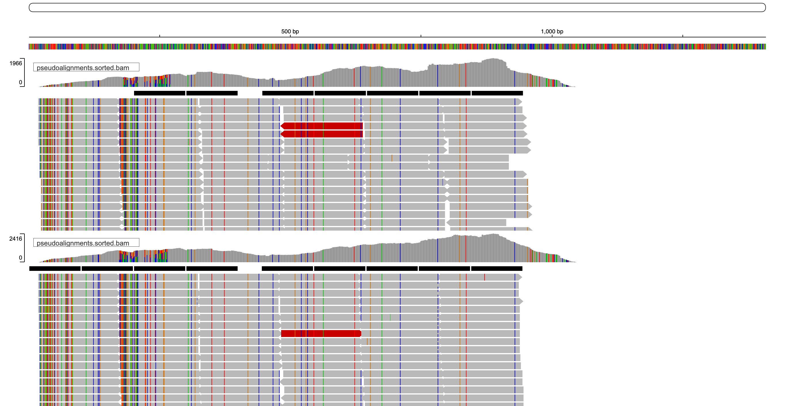
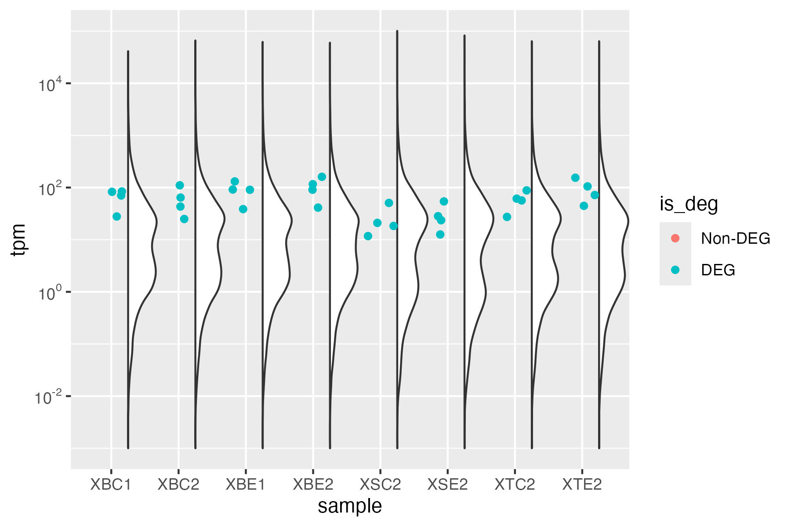

  
```{r setup, include=FALSE}
library(kableExtra)
knitr::opts_chunk$set(echo = TRUE)
```

* **Rationale:** Looking at gene expression of Trebouxia using the newly produced genome and the metatranscriptomic data from an earlier publication (Tagirdzhanova et al. 2025, Curr. Biol.)

## 1. Sample overview: metatranscriptomics
* Of the metatranscriptomic data, will include 8 samples, from 4 thalli. From each thallus, will use the thallus_centre and thallus_edge samples. In the list of 4 thalli, included all that have both types of samples

```{r, message = FALSE,warning=FALSE}
library(tidyverse)
samples<-read.delim("../data/RNA_seq/found_samples_in_sequences_db_thallus.csv",sep=",")

samples %>% filter(sample_focus %in% c("thallus_centre","thallus_edge")) %>%
  group_by(sample_focus,thallus_id) %>% summarize(n=n()) %>% pivot_wider(names_from = sample_focus, values_from = n, values_fill = 0)

```

* List the samples
```{r, message = FALSE,warning=FALSE}
samples<-read.delim("../data/RNA_seq/found_samples_in_sequences_db_thallus.csv",sep=",")

lichen_samples_selected <- samples %>% filter(sample_focus %in% c("thallus_centre","thallus_edge"),
                   thallus_id %in% c("XB1","XB2","XS2","XT2")) 
lichen_samples_selected %>%select(runfiles)

```

## 2. Index transcript file
* Added samtools index to the mRNA transcript file
```{r,eval=F}
source package c92263ec-95e5-43eb-a527-8f1496d56f1a
samtools faidx  analysis_and_temp_files/02_genome_annotation/GTX0536_pred2/annotate_results/Trebouxia_sp._A48.mrna-transcripts.fa
```
* Indexed the list with kallisto v0.44.0
```{r,eval=F}
source package c1ac247d-c4d1-4747-9817-bf03617f979b
kallisto index -i analysis_and_temp_files/06_transcriptomics/Trebouxia_sp._A48.idx analysis_and_temp_files/02_genome_annotation/GTX0536_pred2/annotate_results/Trebouxia_sp._A48.mrna-transcripts.fa
```

## 3. Mapping
### 3.1 Lichen metatranscriptome

#### Strategy overview
* Will use the trimmed files from Tagirdzhanova et al. 2025, Curr. Biol.
  * These files were trimmed with cutadapt
  * rRNA removed with sortmerna
  * Pseudomapped to the set of MAGs, including multiple Trebouxia MAGs with kallisto 0.46.2
```{r,eval=F}
source package /tgac/software/testing/bin/cutadapt-1.17
cutadapt -u 10 -j 8 --adapter=AGATCGGAAGAG -A=AGATCGGAAGAG -A="T{100}" -n 2 --minimum-length=25  -o trimmed_reads/"$sample".1.fq.gz -p  trimmed_reads/"$sample".2.fq.gz  "$file"_1.fq.gz "$file"_2.fq.gz 

source package /tgac/software/testing/bin/sortmerna-3.0.3 
source package /tsl/software/testing/bin/bbmap-37.90  

reformat.sh in1="$fqtrimmed1" in2="$fqtrimmed2" out=analysis_and_temp_files/03_qc/trimmed_reads/"$sample"_trimmed.1.bbmapmerged.fq.gz overwrite=true

sortmerna --ref data/silva132_90.fna,data/silva132_90.idx --reads-gz analysis_and_temp_files/03_qc/trimmed_reads/"$sample"_trimmed.1.bbmapmerged.fq.gz --fastx --paired_in        --aligned analysis_and_temp_files/03_qc/trimmed_reads/"$sample"_trimmed.bbmapmerged.rRNA --other analysis_and_temp_files/03_qc/trimmed_reads/"$sample"_trimmed.bbmapmerged.non_rRNA -v -d analysis_and_temp_files/03_qc/sortmerna_tmp/$sample -a threads

reformat.sh in=analysis_and_temp_files/03_qc/trimmed_reads/"$sample"_trimmed.bbmapmerged.non_rRNA.fastq out1=analysis_and_temp_files/03_qc/trimmed_reads/"$sample"_trimmed.bbmapmerged.non_rRNA.1.fq out2=analysis_and_temp_files/03_qc/trimmed_reads/"$sample"_trimmed.bbmapmerged.non_rRNA.2.fq overwrite=true

kallisto quant -i $idx -t $threads -b $boots -o $out $fq1 $fq2
```
* To make sure there is no mapping of mycobiont transcripts to our genome, will extract reads from the pseudobams created during the metatranscriptomic analysis, and feed them into kallisto

#### Extracting algal reads from the lichen metatranscriptomes
* Made a bed file for all algal transcrits from the MAGs used in the Curr. Biol. analysis
  * The input file is too big for github, did not add it here
```{r,eval=F}
grep "Trebouxiophyceae" ../03_transcriptomic_analysis/analysis_and_temp_files/06_meta_mapping/kallisto_report_add_info.txt | awk '{print $1 "\t" 1 "\t" $2}' | sort | uniq >  analysis_and_temp_files/06_transcriptomics/Trebouxia_loci.txt
```
* Made a script for pulling out only read mapped to the selected loci
```{r,eval=F}
source package c92263ec-95e5-43eb-a527-8f1496d56f1a
source package cf33bb3d-b7c0-450b-ac7d-ebedff25d497 
source package 1041444f-cd25-4107-a5c7-5e86cb1728fe

samtools sort ../03_transcriptomic_analysis/analysis_and_temp_files/06_meta_mapping/XBC2_kallisto/pseudoalignments.bam -o ../03_transcriptomic_analysis/analysis_and_temp_files/06_meta_mapping/XBC2_kallisto/pseudoalignments.sorted.bam

samtools index ../03_transcriptomic_analysis/analysis_and_temp_files/06_meta_mapping/XBC2_kallisto/pseudoalignments.sorted.bam

#extract only reads that mapped as their primary alignment
samtools view -h -b -F 256 -L analysis_and_temp_files/06_transcriptomics/Trebouxia_loci.txt ../03_transcriptomic_analysis/analysis_and_temp_files/06_meta_mapping/XBC2_kallisto/pseudoalignments.sorted.bam > analysis_and_temp_files/06_transcriptomics/XBC2_algal.bam

#only extract read pairs that are both mapped
samtools fastq -F 12 analysis_and_temp_files/06_transcriptomics/XBC2_algal.bam > analysis_and_temp_files/06_transcriptomics/XBC2_algal.fastq

#sort
seqkit sort -n analysis_and_temp_files/06_transcriptomics/XBC2_algal.fastq > analysis_and_temp_files/06_transcriptomics/XBC2_algal.sorted.fastq 

#split into two pairs
reformat.sh in=analysis_and_temp_files/06_transcriptomics/XBC2_algal.sorted.fastq out1=analysis_and_temp_files/06_transcriptomics/XBC2_algal.1.fastq out2=analysis_and_temp_files/06_transcriptomics/XBC2_algal.2.fastq overwrite=true

gzip analysis_and_temp_files/06_transcriptomics/XBC2_algal.1.fastq
gzip analysis_and_temp_files/06_transcriptomics/XBC2_algal.2.fastq
```

* Use that to make a kallisto analysis
```{r,eval=F}
bash code/kallisto.sh analysis_and_temp_files/06_transcriptomics/Trebouxia_sp._A48.idx 20 100 analysis_and_temp_files/06_transcriptomics/XBC2_algal.1.fastq.gz analysis_and_temp_files/06_transcriptomics/XBC2_algal.2.fastq.gz analysis_and_temp_files/06_transcriptomics/XBC2_kallisto/abundance.tsv  
```
* This test run resulted in 65.1% unique mapping rate

#### Running kallisto 
* Prepped the Snakemake file to map all transcriptomes of interest. Saved it in `analysis_and_temp_files/06_transcriptomics/Snakemake_kallisto`
* Made a single table with all mapping results, saved in `analysis_and_temp_files/06_transcriptomics/kallisto_report.txt`

* Sample stdout is bolow. Overall mapping rate of 6.7% matches what we'd expect from a lichen metatranscriptome
```{r,eval=F}
[quant] fragment length distribution will be estimated from the data
[index] k-mer length: 31
[index] number of targets: 14,561
[index] number of k-mers: 23,077,583
[quant] running in paired-end mode
[quant] will process pair 1: ../03_transcriptomic_analysis/analysis_and_temp_files/03_qc/trimmed_reads/XTC2_trimmed.bbmapmerged.non_rRNA.1.fq.gz
                             ../03_transcriptomic_analysis/analysis_and_temp_files/03_qc/trimmed_reads/XTC2_trimmed.bbmapmerged.non_rRNA.2.fq.gz
[progress] 22M reads processed (6.7% mapped)              done
[quant] processed 22,678,997 reads, 1,526,702 reads pseudoaligned
[quant] estimated average fragment length: 248.3
[   em] quantifying the abundances ... done
[   em] the Expectation-Maximization algorithm ran for 870 rounds
[bstrp] number of EM bootstraps complete: 100
```

## 4. Overview
* Transcript mapping rate goes from 67.9% to 73.5%
```{r,message = FALSE,fig.width=10,fig.height=10}
kallisto_report<-read.delim("../analysis_and_temp_files/06_transcriptomics/kallisto_palign_report.txt",header=F)
colnames(kallisto_report)<-c("sample","Percent_Aligned")
kallisto_report<- kallisto_report %>% left_join(samples,by=c("sample"="samples"))


ggplot(kallisto_report) + geom_bar(aes(x=Percent_Aligned,y=sample,fill=sample_focus), stat="identity") +
  xlab("% mapped") + theme_bw()+
  theme(axis.text = element_text(size=7))+
  facet_wrap(~thallus_id,ncol=1,scales="free_y")
```

* Create tpm table from kallisto output
```{r,message = FALSE,fig.width=10,fig.height=10}
counts<-read.delim2("../analysis_and_temp_files/06_transcriptomics/kallisto_report.txt",sep="\t",header=F)
colnames(counts)<-c("TranscriptID","length","eff_length","est_counts","tpm","sample")
counts$tpm<-round(as.numeric(counts$tpm),digits = 3) #round off tpm upto 3 decimals
counts_tab<-pivot_wider(counts[c(1,5,6)],names_from=sample,values_from = tpm) #widen the table
write.table(counts_tab,"../results/tpm.txt",row.names = F,quote = F,sep="\t")
```

* Plot correlations
```{r,message = FALSE,fig.width=10,fig.height=10}
library(corrplot)
all_counts<- counts_tab[rowSums(counts_tab[c(2:9)])>0,] #remove rows which have 0 in all samples
all<-cor(all_counts[c(2:9)], method="pearson",use="pairwise.complete.obs")
ord_all<-c("XBE1","XBC1","XBE2","XBC2","XSE2","XSC2","XTE2","XTC2") #arrange order according to biological replicates (optional)
all1 <- all[, ord_all]
all1<-all1[ord_all, ]

# For correlation plot
cl<-c("blue","white","red") 
col2<-colorRampPalette(cl)
corrplot(all1,method="color",type="full",is.corr=F, col=col2(200),addgrid.col = 0,tl.cex = 1, tl.col = "black")
ggsave("../results/rna_corelations.pdf", width = 4, height = 4)
```

## 5. Expression difference between center and edge
* Will control for thallus ID
```{r}
library(sleuth)

kal_dirs <- data.frame("sample"=lichen_samples_selected$run_id, 
                       "part"= lichen_samples_selected$sample_focus,
                      thallus = lichen_samples_selected$thallus_id,
                       "path"=paste0("../analysis_and_temp_files/06_transcriptomics/",lichen_samples_selected$run_id,"_kallisto"))  
write.table(kal_dirs,"../analysis_and_temp_files/06_transcriptomics/kal_dirs.txt",row.names = F,quote = F,col.names = T,sep="\t")
```

* define list of genes to be included: only those that have read count across whole panel of >=5
```{r}
d<-read.delim("../results/tpm.txt",sep="\t")
rownames(d)<-d$TranscriptID
d<-d %>% select(-TranscriptID)
colnames(d)
d$max<-apply(d,1,max)
min(d$max)
d1<-d[which(d$max>=5),] #to remove lowly expressed genes, keep rows in which max read count across whole panel is atleast 5

# drop the max column, as its not needed anymore
raw_counts<-d1 %>% select(-max)
length(rownames(d1)) # total number of genes
target_id<-rownames(d1)#make the list of selected genes
write.table(target_id,"../analysis_and_temp_files/06_transcriptomics/target_id.txt",row.names = F,quote = F,col.names = F)
```

* modeled the DGE following the official tutorial
* Overall, the thallus identity contributes to most of variation, but still between each couple of samples center samples are always positioned to the right on PC1
```{r,eval=F}
kal_dirs<- read.delim2("../analysis_and_temp_files/06_transcriptomics/kal_dirs.txt",sep="\t")
kal_dirs$part <- as.factor(kal_dirs$part)
kal_dirs$path<-as.character(kal_dirs$path)
target_id<-read.delim2("../analysis_and_temp_files/06_transcriptomics/target_id.txt",header=F)
target_id<-as.vector(target_id$V1)

ec_so <- sleuth_prep(kal_dirs,extra_bootstrap_summary = T,filter_target_id = target_id,transformation_function = function(x) log2(x + 0.1))

#model that includes only confounding variables
ec_so <- sleuth_fit(ec_so, ~thallus, 'reduced') 
#model that includes only both the confounding variable and the variable of interest
ec_so  <- sleuth_fit(ec_so, ~thallus + part, 'full')
ec_so <- sleuth_lrt(ec_so, 'reduced', 'full')
ec_so <- sleuth_wt(ec_so, 'partthallus_edge')
sleuth_save(ec_so, "../analysis_and_temp_files/06_transcriptomics/edge_center.sleuth")
```
* Plot
```{r}
ec_so <- sleuth_load("../analysis_and_temp_files/06_transcriptomics/edge_center.sleuth")
plot_pca(ec_so, color_by = 'part', text_labels = TRUE,use_filtered=T)
```

* Got only 4 genes, all upregulated in the edge. All b-values are within the -1 to 1 window, meaning low FC. 
```{r}
ec_table <- sleuth_results(ec_so, 'partthallus_edge')
ec_sig <- ec_table %>% tibble::as_tibble() %>% 
  filter( qval <= 0.05) %>% 
  arrange(desc(b)) %>% mutate(change = if_else(b > 0, "edge", "centre"))

table(ec_sig$change)
```

* Checking the annotations. 
```{r}
ann<-read.delim("../analysis_and_temp_files/02_genome_annotation/GTX0536_pred2/Trebouxia_sp._A48.annotations.reduced.txt")
ec_sig <- ec_sig %>% left_join(ann,by=c("target_id"="TranscriptID"))

ec_sig%>% 
  kable(format = "html", col.names = colnames(ec_sig)) %>%
  kable_styling() %>%
  kableExtra::scroll_box(width = "100%", height = "400px")
```
* Unexpectedly, 3 of the edge-upregulated genes have the same domain, IPR022796 Chlorophyll A-B binding protein. They are spread between 3 different contigs
```{r}
ec_sig2 <- ec_sig %>% filter(grepl("IPR001344",InterPro))

ec_sig2 %>%
  kable(format = "html", col.names = colnames(ec_sig)) %>%
  kable_styling() %>%
  kableExtra::scroll_box(width = "100%", height = "400px")
```

* None of them are secreted
```{r}
secretome<-read.delim("../results/secretome.txt")
ec_sig %>% filter(target_id %in% secretome$TranscriptID)
```

* Saved the table
```{r}
write.table(ec_sig,"../results/dge_thallus_parts.txt",row.names = F,quote = F,col.names = T,sep="\t")
```

#### Expression of Chlorophyll A-B binding protein
* The 3 proteins are quite unlike
```{r}
library(Biostrings)
library(pwalign)

faa<-readAAStringSet("../analysis_and_temp_files/06_transcriptomics/chlorophyll_binding.faa")
names(faa) <-  word(names(faa),1)

pairwise_pid <- function(fa,a,b){
y<-data.frame("pid"=pwalign::pid(pwalign::pairwiseAlignment(fa[[a]],fa[[b]],
               substitutionMatrix="BLOSUM62",gapOpening=10, gapExtension=4)),
          seq1= names(fa)[a], seq2=names(fa)[b])
return(y)}

pairs<-expand.grid(1:3,1:3)
l<- apply(pairs, 1, function(x) pairwise_pid(faa,x[1],x[2]) )
faa_pid<-do.call(rbind,l)

ggplot(faa_pid,aes(x=seq1,y=seq2,fill=pid,label=round(pid,2)))+
  geom_tile() +geom_text(size=2)+
  scale_fill_gradient(low="white",high="#A63446", limits=c(0,100))+
  scale_x_discrete(expand=c(0,0)) +
  scale_y_discrete(expand=c(0,0))+theme_classic() +
  theme(axis.text.x=element_text(angle=90,size=6),axis.title=element_blank(),
       axis.text.y=element_text(size=6) )
ggsave("../results/chlorophyll_binding_matrix_faa.pdf", width = 5, height = 4)
```

* Same for transcripts
```{r}
library(Biostrings)
fna<-readDNAStringSet("../analysis_and_temp_files/06_transcriptomics/chlorophyll_binding.fna")
names(fna) <-  word(names(fna),1)

pairwise_pid2 <- function(fa,a,b){
y<-data.frame("pid"=pwalign::pid(pwalign::pairwiseAlignment(fa[[a]],fa[[b]],gapOpening=10, gapExtension=4, substitutionMatrix=pwalign::nucleotideSubstitutionMatrix(match = 1, mismatch = -3, baseOnly = TRUE))),
          seq1= names(fa)[a], seq2=names(fa)[b])
return(y)}

l2<- apply(pairs, 1, function(x) pairwise_pid2(fna,x[1],x[2]) )
fna_pid<-do.call(rbind,l2)

ggplot(fna_pid,aes(x=seq1,y=seq2,fill=pid,label=round(pid,2)))+
  geom_tile() +geom_text(size=2)+
  scale_fill_gradient(low="white",high="#A63446", limits=c(0,100))+
  scale_x_discrete(expand=c(0,0)) +
  scale_y_discrete(expand=c(0,0))+theme_classic() +
  theme(axis.text.x=element_text(angle=90,size=6),axis.title=element_blank(),
       axis.text.y=element_text(size=6) )
ggsave("../results/chlorophyll_binding_matrix_fna.pdf", width = 5, height = 4)
```

* All in all, the highest similarity was `r max(faa_pid$pid[faa_pid$pid<100])` for the AA alignment and `r max(fna_pid$pid[fna_pid$pid<100])` for the DNA alignment
* The lowest was `r min(faa_pid$pid)` for the AA alignment and `r min(fna_pid$pid)` for the DNA alignment

* Looking at the expression pattern
```{r,fig.width=8,fig.height=10,message=F,warning=F}
chlor_expresstion <- ec_so$obs_norm[ec_so$obs_norm$target_id %in% ec_sig2$target_id,]
chlor_expresstion <- dplyr::select(chlor_expresstion, target_id, sample, 
            tpm) %>% left_join(ec_so$sample_to_covariates)

write.table(chlor_expresstion, file="../analysis_and_temp_files/06_transcriptomics/chlorophyll_expression.txt", quote=F, sep='\t', row.names=F)

library(RColorBrewer)
color_scheme<-c("thallus_centre"=brewer.pal(3,"Dark2")[2], 
               "thallus_edge" =brewer.pal(3,"Dark2")[3] )

ggplot(chlor_expresstion, aes(color=part,y=tpm,x=part))+
  geom_segment( aes(x=part, xend=part, y=0, yend=tpm))+
  geom_point(stat = "identity",position=position_dodge(width = .5))+
  facet_grid(target_id~thallus,scales="free")+
  xlab("")+ylab("Expression: TPM")+
  theme_bw()+ scale_x_discrete(guide = guide_axis(angle = 45))+
  scale_color_manual( values = color_scheme)+
  theme(text=element_text(size=6),legend.position="bottom")

ggsave('../results/chlorophyll_lopipop.pdf', width = 4, height = 5)
```

* To check that the mapping isn't erroneous, looked at one of the pseudo-BAM files produced by kallisto
```{r,eval=F}
samtools sort analysis_and_temp_files/06_transcriptomics/XBC2_kallisto/pseudoalignments.bam -o analysis_and_temp_files/06_transcriptomics/XBC2_kallisto/pseudoalignments.sorted.bam

samtools index analysis_and_temp_files/06_transcriptomics/XBC2_kallisto/pseudoalignments.sorted.bam

samtools sort analysis_and_temp_files/06_transcriptomics/XBE2_kallisto/pseudoalignments.bam -o analysis_and_temp_files/06_transcriptomics/XBE2_kallisto/pseudoalignments.sorted.bam

samtools index analysis_and_temp_files/06_transcriptomics/XBE2_kallisto/pseudoalignments.sorted.bam
```
* Compared two libraries, XBC2 and XBE2. Overall look very similar
```{r,out.width = '50%'}

```

* Copied sequence of one read and searched it against the genome assemblies:
  * For Trebouxia, it mapped to the same place as the gene
  * No hits in Xanthoria
```{r,eval=F}
source package d6092385-3a81-49d9-b044-8ffb85d0c446

blastn -query analysis_and_temp_files/06_transcriptomics/read_GTX0536PRED_008759-T1.fa -subject analysis_and_temp_files/02_genome_annotation/GTX0536_pred2/annotate_results/Trebouxia_sp._A48.scaffolds.fa -outfmt 6 -evalue 1e-40
>read    GTX0536_11      96.774  124     4       0       27      150     2043670 2043547 2.22e-53        207

blastn -query analysis_and_temp_files/06_transcriptomics/read_GTX0536PRED_008759-T1.fa -subject ../02_long_read_assemblies/analysis_and_temp_files/06_annotate_lecanoro/GTX0501_pred/annotate_results/Xanthoria_parietina_GTX0501.scaffolds.fa -outfmt 6 -evalue 1e-40
```
* How strongly are these genes expressed compared to others? Could it be that they are super-strongly expressed and that somehow interferes with the DGE analysis?
  * This clearly shows that no, these genes are completely within the range
```{r}
library(see)
expr_level <- counts %>% 
  mutate(is_deg = if_else(TranscriptID %in% ec_sig$target_id,"DEG","Non-DEG"),
         alpha = if_else(TranscriptID %in% ec_sig$target_id,1,0))
expr_level$is_deg <- factor(expr_level$is_deg,levels=c("Non-DEG","DEG"))

ggplot(expr_level,aes(y=tpm,x=sample))+
  #geom_violin(alpha = 0.7) +
  geom_violinhalf(position = position_nudge(x = .25, y = 0)) +
  #geom_point(position = position_jitter(seed = 1, width = 0.2),aes(color=is_deg),alpha=0.1)+
  geom_point(position = position_jitter(seed = 1, width = 0.2),aes(color=is_deg,alpha=alpha))+
  scale_alpha(range = c(0, 1),guide = 'none')+
  scale_y_log10(
    breaks = scales::trans_breaks("log10", function(x) 10^x),
    labels = scales::trans_format("log10", scales::math_format(10^.x))
  )
ggsave('../results/chlorophyll_expression.pdf', width = 6, height = 4)
ggsave('../results/chlorophyll_expression.png', width = 6, height = 4)
```
```{r}

```

## 6. Data from pure cultures
* Produced 3 libraries from a solid-media culture of Trebouxia

### 6.1. QC
* FastQC shows several fixable problems:
  * low but existing levels adapter contamination (Illumina Universal)
  * non-random per base sequence content and kmer content (first 10 bp)
  * overrepresented sequence in all reverse libraries `GGCCGTGTCACGCGGCTTTGCTGCTGCTGGTGCCAAGAGCCAGTAAGGTC`. It blasts to Trebouxia genomic DNA
  * In one reverse library, got `GGGGGGGGGGGGGGGGGGGGGGGGGGGGGGGGGGGGGGGGGGGGGGGGGG` as an overrepresented sequence
  * In two forward library, got `GCCAAGTCGTCTGCGAGGTTTGAACCCCAATGAACGAGTGGAATTGTCAT` and `CTTGTCCGTACCAGTTCTGAGTTGGTTGTTCGTCGCCAAGGGAGCGACCG	` as overrepresented sequences. They blasts to Trebouxia 18S rRNA
```{r,eval=F}
source package /tsl/software/testing/bin/fastqc-0.11.5 
mkdir analysis_and_temp_files/06_transcriptomics/fastqc_out -p
fastqc /tsl/data/reads/ntalbot/trebouxia_sp__a48_isolate_gtp0183_genome/trebouxia_sp__a48_solid_medium/*/raw/*.fq.gz -o analysis_and_temp_files/06_transcriptomics/fastqc_out
```

### 6.2. Filtering
* Used cutadapt to remove first 10 bp of each read and for adapter cutting + poly-T (and poly-G) removal. With fastQC confirmed that this solved the corresponding problems
```{r,eval=F}
mkdir data/trimmed_reads
source package /tgac/software/testing/bin/cutadapt-1.17

cutadapt -u 10 -U 10 -j 10 --adapter=AGATCGGAAGAG -A=AGATCGGAAGAG -A="T{100}" -A="G{100}" -n 2 --minimum-length=25  -o data/trimmed_reads/GTX0547_trimmed.1.fq.gz -p data/trimmed_reads/GTX0547_trimmed.2.fq.gz  /tsl/data/reads/ntalbot/trebouxia_sp__a48_isolate_gtp0183_genome/trebouxia_sp__a48_solid_medium/gtx0547/raw/GTX0547_EKRN250026392-1A_22W3WJLT4_L4_1.fq.gz  /tsl/data/reads/ntalbot/trebouxia_sp__a48_isolate_gtp0183_genome/trebouxia_sp__a48_solid_medium/gtx0547/raw/GTX0547_EKRN250026392-1A_22W3WJLT4_L4_2.fq.gz 

cutadapt -u 10 -U 10 -j 10 --adapter=AGATCGGAAGAG -A=AGATCGGAAGAG -A="T{100}" -A="G{100}" -n 2 --minimum-length=25  -o data/trimmed_reads/GTX0548_trimmed.1.fq.gz -p data/trimmed_reads/GTX0548_trimmed.2.fq.gz  /tsl/data/reads/ntalbot/trebouxia_sp__a48_isolate_gtp0183_genome/trebouxia_sp__a48_solid_medium/gtx0548/raw/GTX0548_EKRN250026393-1A_22W3WJLT4_L4_1.fq.gz /tsl/data/reads/ntalbot/trebouxia_sp__a48_isolate_gtp0183_genome/trebouxia_sp__a48_solid_medium/gtx0548/raw/GTX0548_EKRN250026393-1A_22W3WJLT4_L4_2.fq.gz

cutadapt -u 10 -U 10 -j 10 --adapter=AGATCGGAAGAG -A=AGATCGGAAGAG -A="T{100}" -A="G{100}" -n 2 --minimum-length=25  -o data/trimmed_reads/GTX0549_l4_trimmed.1.fq.gz -p data/trimmed_reads/GTX0549_l4_trimmed.2.fq.gz  /tsl/data/reads/ntalbot/trebouxia_sp__a48_isolate_gtp0183_genome/trebouxia_sp__a48_solid_medium/gtx0549/raw/GTX0549_EKRN250026394-1A_22W3WJLT4_L4_1.fq.gz /tsl/data/reads/ntalbot/trebouxia_sp__a48_isolate_gtp0183_genome/trebouxia_sp__a48_solid_medium/gtx0549/raw/GTX0549_EKRN250026394-1A_22W3WJLT4_L4_2.fq.gz

cutadapt -u 10 -U 10 -j 10 --adapter=AGATCGGAAGAG -A=AGATCGGAAGAG -A="T{100}" -A="G{100}" -n 2 --minimum-length=25  -o data/trimmed_reads/GTX0549_l3_trimmed.1.fq.gz -p data/trimmed_reads/GTX0549_l3_trimmed.2.fq.gz  /tsl/data/reads/ntalbot/trebouxia_sp__a48_isolate_gtp0183_genome/trebouxia_sp__a48_solid_medium/gtx0549/raw/GTX0549_EKRN250026394-1A_22W3MHLT4_L3_1.fq.gz /tsl/data/reads/ntalbot/trebouxia_sp__a48_isolate_gtp0183_genome/trebouxia_sp__a48_solid_medium/gtx0549/raw/GTX0549_EKRN250026394-1A_22W3MHLT4_L3_2.fq.gz


fastqc data/trimmed_reads/*.fq.gz -o analysis_and_temp_files/06_transcriptomics/fastqc_out
```


* To remove rRNA contamination, will use sortmeRNA to filter out all rRNA mathcing Trebouixa. As a reference, will prepare reference file with rRNA operon from our file. First, let search it in the genome
  * made a query with 18S, 28S, 5S and ITS. 
```{r,eval=F}
blastn -query analysis_and_temp_files/06_transcriptomics/Trebouxia_rRNA_genbank.fa -subject analysis_and_temp_files/02_genome_annotation/GTX0536_nuclear_final2.fasta -outfmt 6 -out analysis_and_temp_files/06_transcriptomics/Trebouxia_rRNA_genbank_nucl.blast

blastn -query analysis_and_temp_files/06_transcriptomics/Trebouxia_rRNA_genbank.fa -subject analysis_and_temp_files/02_genome_annotation/GTX0536_mito.fa -outfmt 6 -out analysis_and_temp_files/06_transcriptomics/Trebouxia_rRNA_genbank_mito.blast

blastn -query analysis_and_temp_files/06_transcriptomics/Trebouxia_rRNA_genbank.fa -subject analysis_and_temp_files/02_genome_annotation/GTX0536_plastid.fa -outfmt 6 -out analysis_and_temp_files/06_transcriptomics/Trebouxia_rRNA_genbank_chloro.blast
```

* For nuclear, there are series of operons in two contigs, ptg000007l and ptg000023l. For each gene, each contig had 10-15 hits per contig. Will select one operon, which is 3.8 Kbp fragment more or less completeley covered by hits: ptg000007l:2406254-2410086
```
MK320925.1      ptg000007l      93.560  854     52      2       1       851     2400076 2400929 0.0     1269
MK320925.1      ptg000007l      93.560  854     52      2       1       851     2408744 2409597 0.0     1269

KX147269.1      ptg000007l      82.544  739     94      22      441     1157    2399358 2400083 7.70e-176       617
KX147269.1      ptg000007l      82.544  739     94      22      441     1157    2408026 2408751 7.70e-176       617

EU123942.1      ptg000007l      99.412  1701    10      0       1       1701    2406304 2408004 0.0     3086
EU123942.1      ptg000007l      99.412  1701    10      0       1       1701    2417692 2419392 0.0     3086

Z95383.1        ptg000007l      96.168  1331    47      4       1       1328    2400089 2401418 0.0     2172
Z95383.1        ptg000007l      96.168  1331    47      4       1       1328    2408757 2410086 0.0     2172

Z21553.1        ptg000007l      99.165  1797    10      5       1       1796    2406254 2408046 0.0     3230
Z21553.1        ptg000007l      99.165  1797    10      5       1       1796    2417642 2419434 0.0     3230
```

* For mito, had one hit from the mito query: ptg000001c:72382-72822, only 440 bp
```
JN847659.1      ptg000001c      92.099  443     17      5       1       427     72822   72382   2.66e-176       608
```
* For plastid, had several hits from the plastid query. These hits cover 3.2 Kbp fragment: ptg000005c:123750-126958
```
EU725860.1      ptg000005c      97.222  1368    22      4       173     1532    126740  125381  0.0     2302
EU725860.1      ptg000005c      100.000 241     0       0       1533    1773    123990  123750  2.81e-126       446
EU725860.1      ptg000005c      100.000 174     0       0       1       174     126958  126785  4.94e-89        322
EU725860.1      ptg000005c      100.000 35      0       0       1771    1805    122571  122537  9.20e-12        65.8
```
* Isolated the sequences
```{r,eval=F}
samtools faidx analysis_and_temp_files/02_genome_annotation/GTX0536_nuclear_final2.fasta ptg000007l:2406254-2410086 > analysis_and_temp_files/06_transcriptomics/Trebouxia_rRNA.fa
samtools faidx analysis_and_temp_files/02_genome_annotation/GTX0536_mito.fa ptg000001c:72382-72822 >> analysis_and_temp_files/06_transcriptomics/Trebouxia_rRNA.fa
samtools faidx analysis_and_temp_files/02_genome_annotation/GTX0536_plastid.fa ptg000005c:123750-126958 >> analysis_and_temp_files/06_transcriptomics/Trebouxia_rRNA.fa
```

* Used sortmerna to index the file
```{r,eval=F}
source package /tgac/software/testing/bin/sortmerna-3.0.3 
mkdir analysis_and_temp_files/06_transcriptomics/sortmerna

indexdb --ref analysis_and_temp_files/06_transcriptomics/Trebouxia_rRNA.fa,analysis_and_temp_files/06_transcriptomics/sortmerna/Trebouxia_rRNA.idx
```

* Used a stand-alone script for sortmerna
```{r,eval=F}
bash code/sortmerna.sh data/trimmed_reads/GTX0547_trimmed.1.fq.gz data/trimmed_reads/GTX0547_trimmed.2.fq.gz GTX0547 20

sbatch --mem=100G -c 20 --partition=nbi-short --wrap="bash code/sortmerna.sh data/trimmed_reads/GTX0548_trimmed.1.fq.gz data/trimmed_reads/GTX0548_trimmed.2.fq.gz GTX0548 20"
  
sbatch --mem=100G -c 20 --partition=nbi-short --wrap="bash code/sortmerna.sh data/trimmed_reads/GTX0549_l3_trimmed.1.fq.gz data/trimmed_reads/GTX0549_l3_trimmed.2.fq.gz GTX0549_l3 20"

sbatch --mem=100G -c 20 --partition=nbi-short --wrap="bash code/sortmerna.sh data/trimmed_reads/GTX0549_l4_trimmed.1.fq.gz data/trimmed_reads/GTX0549_l4_trimmed.2.fq.gz GTX0549_l4 20"
```
* Concatenate both set of reads for GTX0549
```{r,eval=F}
cat analysis_and_temp_files/06_transcriptomics/sortmerna/GTX0549_l3_trimmed.bbmapmerged.non_rRNA.1.fq.gz analysis_and_temp_files/06_transcriptomics/sortmerna/GTX0549_l4_trimmed.bbmapmerged.non_rRNA.1.fq.gz > analysis_and_temp_files/06_transcriptomics/sortmerna/GTX0549_trimmed.bbmapmerged.non_rRNA.1.fq.gz 

cat analysis_and_temp_files/06_transcriptomics/sortmerna/GTX0549_l3_trimmed.bbmapmerged.non_rRNA.2.fq.gz analysis_and_temp_files/06_transcriptomics/sortmerna/GTX0549_l4_trimmed.bbmapmerged.non_rRNA.2.fq.gz > analysis_and_temp_files/06_transcriptomics/sortmerna/GTX0549_trimmed.bbmapmerged.non_rRNA.2.fq.gz 
```

### 6.3. Running kallisto 
* Prepped another Snakemake file to map all transcriptomes of interest. Saved it in `analysis_and_temp_files/06_transcriptomics/Snakemake_kallisto_culture`
* Made a single table with all mapping results, saved in `analysis_and_temp_files/06_transcriptomics/kallisto_report_culture.txt`
* p_unique varied between 74.3 and 74.8

```{r,message = FALSE,fig.width=10,fig.height=10}
kallisto_report_culture<-read.delim("../analysis_and_temp_files/06_transcriptomics/kallisto_palign_report_culture.txt",header=F)
colnames(kallisto_report_culture)<-c("sample","Percent_Aligned")
kallisto_report_culture <- kallisto_report_culture %>% mutate(sample_focus="culture",
                                                             thallus_id="culture" )

ggplot(kallisto_report %>% select(sample_focus,thallus_id,sample,Percent_Aligned) %>%
         rbind(kallisto_report_culture)) + 
  geom_bar(aes(x=Percent_Aligned,y=sample,fill=sample_focus), stat="identity") +
  xlab("% mapped") + theme_bw()+
  scale_fill_manual( values = c("thallus_centre"=brewer.pal(3,"Dark2")[2], 
               "thallus_edge" =brewer.pal(3,"Dark2")[3],
               "culture"=brewer.pal(3,"Dark2")[1]))+
  theme(axis.text = element_text(size=7))+
  facet_wrap(~thallus_id,ncol=1,scales="free_y")
ggsave("../results/rna_mapping.pdf", width = 4, height = 5)
```

### 6.4. Running Sleuth
* Prepping table with kallisto folders to use
```{r,eval=F}
 kal_dirs_culture<-data.frame("sample"=kallisto_report_culture$sample,
   "path"=paste0("../analysis_and_temp_files/06_transcriptomics/",
                 kallisto_report_culture$sample,
                 "_kallisto"),
   "type"="culture")

 kal_dirs_culture <- rbind( kal_dirs_culture,
                            kal_dirs %>% select(sample,path) %>% mutate(type="thallus"))
write.table(kal_dirs_culture,"../analysis_and_temp_files/06_transcriptomics/kal_dirs_culture.txt",row.names = F,quote = F,col.names = T,sep="\t")
```
* Running sleuth
```{r,eval=F}
source package 4306e0b4-5c25-4efe-80a9-23c8b3c6c85c 
source package cdd1748e-2da2-415e-866a-95488b08cd3c 

kal_dirs_culture<- read.delim2("../analysis_and_temp_files/06_transcriptomics/kal_dirs_culture.txt",sep="\t")
kal_dirs_culture$path<-as.character(kal_dirs_culture$path)
target_id<-read.delim2("../analysis_and_temp_files/06_transcriptomics/target_id.txt",header=F)
target_id<-as.vector(target_id$V1)
kal_dirs_culture$type <- as.factor(kal_dirs_culture$type)

ct_so <- sleuth_prep(kal_dirs_culture,extra_bootstrap_summary = F,filter_target_id = target_id,transformation_function = function(x) log2(x + 0.1))

#full model
ct_so  <- sleuth_fit(ct_so, ~type, 'full')
#reduced
ct_so <- sleuth_fit(ct_so, ~1, 'reduced') 
#model that includes only both the confounding variable and the variable of interest

ct_so <- sleuth_lrt(ct_so, 'reduced', 'full')
ct_so <- sleuth_wt(ct_so, 'typethallus')
sleuth_save(ct_so, "../analysis_and_temp_files/06_transcriptomics/culture_thallus.sleuth")
```
* Plot
```{r}
ct_so <- sleuth_load("../analysis_and_temp_files/06_transcriptomics/culture_thallus.sleuth")
plot_pca(ct_so, color_by = 'type', text_labels = TRUE,use_filtered=T,units="tpm")
ggsave('../results/pca_text.pdf',width = 4.5, height = 3)
```

* Plot with dots
```{r}
pca<-plot_pca(ct_so, color_by = 'type', text_labels = F,use_filtered=T,units="tpm")
pca+theme_bw()+theme(text=element_text(size=7))
ggsave('../results/pca_dots.pdf',width = 4.5, height = 3)
```
* Looking at % variation explanied
```{r}
plot_pc_variance(ct_so,use_filtered=T,units="tpm")
```

* Get numeric values
```{r}
ppv <- plot_pc_variance(ct_so,use_filtered=T,units="tpm")
PCpc <- ppv$data$var
names(PCpc) <- paste0("PC", seq(1:length(PCpc)))
PCpc
```

### 6.5. Exploring DEG
* Got 918 genes in this list, but 755 only have |b|>1
```{r}
ct_table <- sleuth_results(ct_so, 'typethallus')
ct_sig <- ct_table %>% tibble::as_tibble() %>% 
  filter( qval <= 0.05) %>% 
  arrange(desc(b)) %>% mutate(change = case_when(b > 1 ~"thallus", 
                                                 b< -1 ~ "culture",
                                                 b<=1&b>=-1 ~ "lowFC"))

table(ct_sig$change)
```

* Checking the annotations. 
```{r}
ct_sig <- ct_sig %>% left_join(ann,by=c("target_id"="TranscriptID"))

#ct_sig%>% 
 # kable(format = "html", col.names = colnames(ct_sig)) %>%
 # kable_styling() %>%
  #kableExtra::scroll_box(width = "100%", height = "400px")
```

* 6 are secreted, including two ferritin domains, one of them upregulated in lichen. Cupin and Cupredoxin upregulated in culture
```{r}
ct_sig %>% filter(target_id %in% secretome$TranscriptID) %>%
  kable(format = "html", col.names = colnames(ct_sig)) %>%
  kable_styling() %>%
  kableExtra::scroll_box(width = "100%", height = "400px")
```

* Save the table
```{r}
ct_sig <- ct_sig %>% mutate(is_secreted = if_else(target_id %in% secretome$TranscriptID,"Yes","No"))
write.table(ct_sig,"../results/dge_culture_thallus.txt",row.names = F,quote = F,col.names = T,sep="\t")
```


### 6.6. Enriched InterPro and GO in lichen
```{r}
library(clusterProfiler)
###make table with GO annotations
go_df <- ann %>% select(TranscriptID,GO.Terms) %>% 
  mutate(GO.Terms = strsplit(GO.Terms, ";")) %>%
        unnest(GO.Terms) %>%
  mutate(GO.Terms=sub(".*? ", "", GO.Terms),
         short_term = substr(GO.Terms, 1,40))

go_data <- list(
    term2protein = data.frame(
                        term = go_df$GO.Terms,
                        gene = go_df$TranscriptID
                        ),
    term2name = data.frame(
                        term = go_df$GO.Terms,
                        name = go_df$short_term
                        ),
    
    universe = unique(as.character(go_df$TranscriptID))
)

### select genes upregulated in lichens and order them by fold change
geneList1 = ct_sig$b[ct_sig$change=="thallus"]
names(geneList1) = ct_sig$target_id[ct_sig$change=="thallus"]
geneList1 = sort(geneList1, decreasing = F)
geneList1 <- names(geneList1)

###enrichment analysis
enrich1<-clusterProfiler::enricher(geneList1,
    pAdjustMethod = "none",
    minGSSize = 1,
    maxGSSize = 2000,
    qvalueCutoff = 1,
    universe=go_data$universe,
    TERM2GENE=go_data$term2protein,
    TERM2NAME=go_data$term2name)

enrichplot::dotplot(enrich1,showCategory=40,label_format=40)
```


* Plot as graph
```{r}
enrich1_pairwise<-enrichplot::pairwise_termsim(enrich1)
enrichplot::emapplot(enrich1_pairwise,layout="nicely",label_group_style = "ggforce")
pdf(file="../results/thallus_upr_go.pdf",width=10,height=8)
enrichplot::emapplot(enrich1_pairwise,layout="nicely",label_group_style = "ggforce")
dev.off()

```

* Now, InterPro domains
```{r}
ips_df <-ann %>% select(TranscriptID,InterPro) %>% 
  mutate(InterPro_new = strsplit(InterPro, ";")) %>%
        unnest(InterPro_new) %>% 
  mutate(short_term = substr(InterPro_new, 1,40))


ips_data <- list(
    term2protein = data.frame(
                        term = ips_df$InterPro_new,
                        gene = ips_df$TranscriptID
                        ),
    term2name = data.frame(
                        term = ips_df$InterPro_new,
                        name = ips_df$short_term
                        ),
    
    universe = unique(as.character(ips_df$TranscriptID))
)

###enrichment analysis
enrich2<-clusterProfiler::enricher(geneList1,
    pAdjustMethod = "none",
    minGSSize = 1,
    maxGSSize = 2000,
    qvalueCutoff = 1,
    universe=ips_data$universe,
    TERM2GENE=ips_data$term2protein,
    TERM2NAME=ips_data$term2name)

enrichplot::dotplot(enrich2,showCategory=40,label_format=40)

```

* Plot as graph
```{r}
enrich2_pairwise<-enrichplot::pairwise_termsim(enrich2)
enrichplot::emapplot(enrich2_pairwise,layout="nicely",label_group_style = "ggforce")

pdf(file="../results/thallus_upr.pdf",width=10,height=8)
enrichplot::emapplot(enrich2_pairwise,layout="nicely",label_group_style = "ggforce")
dev.off()

```

### 6.7. Enriched InterPro and GO in culture
```{r}
library(clusterProfiler)
library(enrichplot)
### select genes upregulated in lichens and order them by fold change
geneList3 = ct_sig$b[ct_sig$change=="culture"]
names(geneList3) = ct_sig$target_id[ct_sig$change=="culture"]
geneList3 = sort(geneList3, decreasing = T)
geneList3 <- names(geneList3)

###enrichment analysis
enrich3<-clusterProfiler::enricher(geneList3,
    pAdjustMethod = "none",
    minGSSize = 1,
    maxGSSize = 2000,
    qvalueCutoff = 1,
    universe=go_data$universe,
    TERM2GENE=go_data$term2protein,
    TERM2NAME=go_data$term2name)

enrichplot::dotplot(enrich3,showCategory=40,label_format=40)
```

* Plot as graph
```{r}
enrich3_pairwise<-enrichplot::pairwise_termsim(enrich3)
enrichplot::emapplot(enrich3_pairwise,layout="nicely")
pdf(file="../results/culture_upr_go.pdf",width=10,height=8)
enrichplot::emapplot(enrich3_pairwise,layout="nicely",label_group_style = "ggforce")
dev.off()
```

* Now, InterPro domains
```{r}

###enrichment analysis
enrich4<-clusterProfiler::enricher(geneList3,
    pAdjustMethod = "none",
    minGSSize = 1,
    maxGSSize = 2000,
    qvalueCutoff = 1,
    universe=ips_data$universe,
    TERM2GENE=ips_data$term2protein,
    TERM2NAME=ips_data$term2name)

enrichplot::dotplot(enrich4,showCategory=40,label_format=40)

```

* Plot as graph
```{r}
enrich4_pairwise<-enrichplot::pairwise_termsim(enrich4)
enrichplot::emapplot(enrich4_pairwise,layout="nicely")

pdf(file="../results/culture_upr.pdf",width=10,height=8)
enrichplot::emapplot(enrich4_pairwise,layout="nicely",label_group_style = "ggforce")
dev.off()
```
